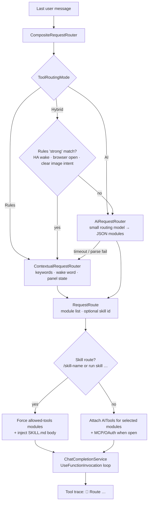
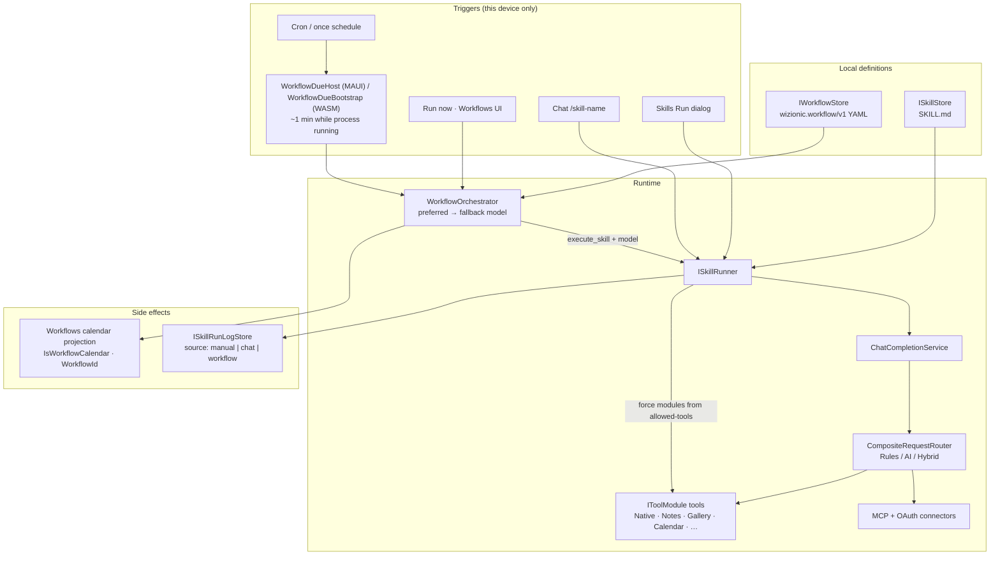
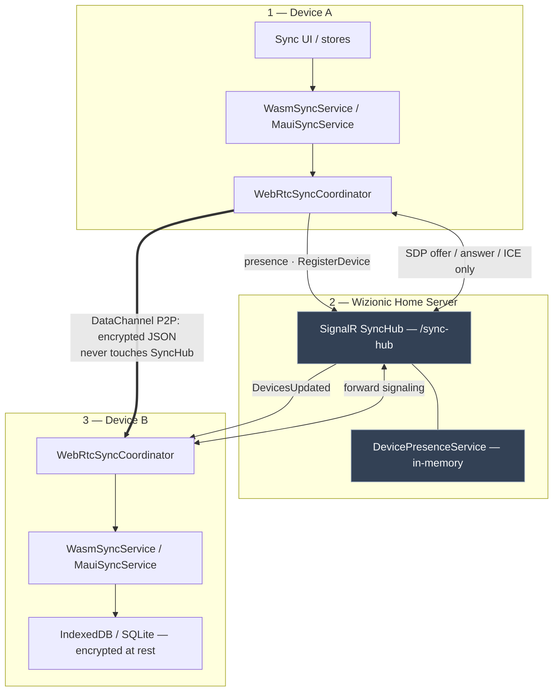

# Wizionic Architecture

**Purpose:** Developer / agent reference for this codebase (what exists today). 

**Stack:** .NET 10 · Blazor Web App (Auto: server shell + Interactive WebAssembly) · Blazor Hybrid (MAUI Windows/mobile) · Linux desktop (GirCore Adwaita + WebKit) · SQLite · SignalR · WebRTC · Microsoft.Extensions.AI · WebView2 (Windows browser) / WebKitGTK (Linux browser)

---

## Core Values

- **Local AI** — **AMD Lemonade Server** and **Ollama** can be installed with the setup wizard on the user's machine as first-class local AI providers (chat, multimodal, and Lemonade-specific modalities). 
- **Tools Available** — Native app tools (Notes, Gallery, Calendar, Browser, web search, weather), optional OAuth OpenAPI connectors, user-selected MCP servers, first class **Home Assistant** integration — all via `Microsoft.Extensions.AI` function calling and a rules / AI / hybrid tool router.  Tools can then be used in Skills or scheduled in Workflows.
- **Privacy-first** — Chat history, notes, gallery images, and calendar events live on the client (IndexedDB / SQLite), encrypted at rest. When the public server is used as the Home Server, it does not store conversation or personal content for WASM/MAUI client.
- **Local Device to Device sync** — WebRTC DataChannel carries encrypted chats, notes, gallery, calendar, and selected settings; SignalR from the Home Server is presence + signaling only.
- **Minimal Server Footprint**  The desktop app plus a **Home Server** on the installed PC covers login, magic-link/2FA APIs, SignalR presence, and WebRTC signaling. The hosting app uses **`http://localhost:5150`**; Kestrel binds `http://*:5150` so other devices use `{hostname}.local:5150` or the LAN IPv4 (Windows Firewall Private rule on 5150). Installing Home Server from the setup wizard downloads that package from **GitHub Releases** and retargets this app’s login server to localhost. Desktop *app* updates also come from GitHub. The hosted site (Wizionic.com) is only an optional public host (web client + the same APIs) for people who do not run their own Home Server.
- **Mobile Device Support** The WASM website from the Home Server can be installed as a Progressive Web App (PWA) on Android and IOS devices.  A logged-in mobile device can relay chat AI to other devices over WebRTC.
- **Easy UI** — Make setup of local AI, integrations, and the user's private data as easy as possible.

---

## Solution Layout

```
App/
├── ARCHITECTURE.md     # This file (repo root)
├── App.csproj          # Host (Server): ASP.NET Core, APIs, SignalR hub, SQLite, auth
├── App.Core/           # Business Logic & Contracts: Interfaces, DTOs, shared models
├── App.Shared/         # Shared UI & logic: Razor components, Layouts, Common services (used by both WASM & MAUI)
├── App.Client/         # WASM Implementation: Browser-specific implementations (IndexedDB, JS Crypto)
├── App.Maui/           # Desktop/mobile clients: MAUI (Win/iOS/Android) + Linux desktop (net10.0)
├── Components/         # Server shell for Blazor Web App (App.razor, Routes.razor)
├── Apis/               # Host API endpoints (WasmApiEndpoints, SyncHub, etc.)
├── Data/               # Server-side EF Core entities + AppDbContext
├── Services/           # Server-only services: email, key protection, AI proxy
├── Pages/              # Optional server-rendered pages (e.g. Roadmap)
└── wwwroot/            # Static assets; product roadmap markdown
```

### Project Sharing Model: WASM vs desktop clients

| Layer | Shared? | Role |
|-------|---------|------|
| **`App.Core`** | ✅ Yes | Defines the "what": Interfaces (`IConversationStore`, `ISyncService`) and DTOs. No platform-specific code. |
| **`App.Shared`** | ✅ Yes | Defines the "how it looks": Razor components (`ChatPage`, `NotesPage`), Layouts, and logic common to WASM & desktop. |
| **`App.Client`** | ❌ No | WASM-specific: Implements Core interfaces using browser APIs (IndexedDB, WebCrypto). |
| **`App.Maui`** | ❌ No | Native desktop/mobile: SQLite storage, SIPSorcery WebRTC, platform browser hosts. **Windows/mobile** = MAUI Blazor Hybrid + WebView2; **Linux** = GirCore Adwaita + WebKit (not full MAUI). |


---

## Authentication & Encryption

### Sign-in required
- App features (chat, notes, gallery, calendar, tools, settings, local AI, sync) are unavailable until the user has an account. The first successful **login code** for a new email creates the account (not on the request itself).
- User requests a login code → email via Brevo (SMTP fallback) → type the 10-character code in the app or site. `/magic-login` does **not** consume a token (wrong-app clicks and mail scanners). Password and optional 2FA are alternatives. Recovery codes are shown once when 2FA is enabled. A confirmed device is remembered for 30 days. Forgot password (`POST /api/auth/reset-password`) uses the same emailed login code to **clear** the password and turn 2FA off so the account page shows **Add a password** again; it does not bypass 2FA for ordinary code login.
- Persistent cookie (`AppAuth`, or `__Host-AppAuth` on public HTTPS) with a **server-side session** row (revocable). Sliding 10-year expiry; no idle logout. Password change, password reset, and “sign out other devices” revoke other sessions. Existing cookies are upgraded, not rejected.
- Per-user **encryption key** is generated once and never rotated on login, password change, password reset, or session revoke. WASM calls `/api/auth/me` and `/api/user/encryption-key` (cookie + `X-Wizionic-Device-Id`). A bound session used from a different device must sign in again before it can fetch the key or join sync; old clients that omit the header still work.
- Data namespace: `u-{userId}-`. Signed-out UI prefs may still use a historical `wasmchat-` prefix so they never land on authenticated keys.

### At-rest encryption
- Conversation, note, gallery image, and calendar event **content blobs** are AES-256-GCM encrypted before local write (`WasmCryptoService` + JS helpers on WASM; native crypto on MAUI).
- Metadata (titles, dates, album/calendar names, sync flags) is cleartext for fast listing.
- User OAuth access tokens and MCP tokens live in `IKeyStore` (encrypted when signed in), not in the central server DB.

---

## Chat Flow

```
User types in ChatPage.razor
        │
        ▼
ChatCompletionService.CompleteAsync()  (Shared)
        │
        ├── Build history from IConversationStore (decrypted messages)
        ├── Prepend system prompt (profile settings from IKeyStore)
        ├── Trim history to context window (reserve room for reply); track stats
        ├── If model supports tools → CompositeRequestRouter (Rules / AI / Hybrid)
        │       ├── Native tools (search_web, summarize_url, get_time, …) via /api/tools/*
        │       ├── Notes / Gallery / Calendar tool modules (local stores)
        │       ├── OAuth OpenAPI connector tools (when installed)
        │       ├── MCP tools from McpToolSource
        │       └── Lemonade client tools (image/STT/TTS) when configured
        └── ChatModelCatalogService.GetChatClientForModel()
                ├── ollama/*     → direct to Ollama OpenAI-compat (default :11434/v1)
                ├── lemonade/*   → direct to Lemonade OpenAI-compat (default :13305/v1)
                │                 · image models → LemonadeImageService (not chat loop)
                │                 · Omni collections → server-side multimodal tools
                ├── proxied/*    → POST /api/proxy/chat (server-side key)
                └── user-keyed cloud/{provider}/* → OpenAI-compat client (base URL + key on device)
        │
        ▼
Streaming tokens → UI (TTFT / total / ctx used/limit); IConversationStore saves encrypted JSON
        │
        └── If authenticated + auto-sync on → ISyncService queues WebRTC sync
```

**Context compact:** Toolbar button summarizes older turns to free window space without clearing the chat.

### Notes (local notebooks + AI tools)

| Piece | Detail |
|-------|--------|
| **UI** | `NotesPage.razor` (`/notes`) — notebooks, Quill HTML entries, floating add; click-to-edit; last notebook restored on this device; sidebar search / Ask my notes |
| **Store** | `INoteStore` — WASM IndexedDB / MAUI SQLite; bodies AES-GCM encrypted; titles cleartext |
| **Dictation** | Mic on the Quill toolbar; rolling ~25s STT windows via `ISpeechTranscriptionService`. Model is `UserProfileSettings.NotesSttModelId` (Settings → Voice), not the Chat profile STT slot |
| **Lecture audio** | MAUI only: `INoteAudioStore` encrypted opus/webm blobs in `note_audio_*` tables. Device-local (not WebRTC). WASM is dictation-only |
| **Theme** | Note paper and default ink follow the app theme; authored inline colors stay as written |
| **Chat handoff** | “Add to notes” from chat; Notes → Chat “Edit with AI” (`INotesChatHandoff`); optional images via `IConversationMediaBuffer` |
| **AI tools** | `NotesToolModule`: `search_notes`, `list_notebooks`, `list_note_entries`, `create_notebook`, `add_note_entry`, `append_to_note_entry`, `update_note_entry` |
| **Search** | `INotesSearchService` decrypt-on-search over unlocked notebooks (no plaintext FTS on disk) |
| **Routing** | Attached when `ContextualRequestRouter.MessageSuggestsNotesTools` (or AI router picks `Notes`) |
| **Protection** | Password-protected notebooks blocked for tools until unlocked in the UI |
| **Sync** | Auto-sync after local save via `INotesSyncBridge`; merge via `NoteSyncMerger` (entry LWW). Audio bytes do not sync |

### Gallery (albums + AI tools)

| Piece | Detail |
|-------|--------|
| **UI** | `GalleryPage.razor` (`/gallery`) — albums, grid, lightbox, password-protect album, reorder |
| **Store** | `IGalleryStore` — album meta + encrypted image bytes; thumbs for grid; short-lived display URLs for lightbox (avoid multi-MB data URLs in Blazor) |
| **Chat handoff** | Lemonade/chat-generated images can be saved into albums; `IConversationMediaBuffer` + `IGalleryChatHandoff` |
| **AI tools** | `GalleryToolModule`: `list_gallery_albums`, `list_recent_chat_images`, `save_to_gallery` |
| **Routing** | Gallery intent heuristics, or image generate + “save to gallery” paths; often co-attached with Lemonade |
| **Sync** | `SyncItemKind.Album` (meta only) + `AlbumImage` (per-image); `GallerySyncMerger` / bridges |
| **Quota** | `IStorageQuotaService` + `SumStoredImageBytesAsync` (meta size sum) |

No server-side gallery storage.

### Calendar (local multi-calendar + AI tools)

| Piece | Detail |
|-------|--------|
| **UI** | `CalendarPage.razor` (`/calendar`) — Google Calendar–style Day / Week / Month / Year; mini-month sidebar; color + visibility layers |
| **Models** | RFC 5545–aligned `LocalCalendar` / `CalendarEvent`; `WorkflowId` (`X-WIZIONIC-WORKFLOW`) reserved for future workflow triggers |
| **Store** | `ICalendarStore` — meta cleartext for grid; full event JSON AES-GCM encrypted |
| **iCalendar** | `CalendarIcs` (Ical.Net) — export/import `.ics`, ICS URL **subscribe** (poll; WASM via `/api/calendar/ics-fetch`), RRULE presets, occurrence expansion. Subscribed event rows are device-local (not WebRTC), like Workflows. Sound alerts while the app is running. |
| **AI tools** | `CalendarToolModule`: `list_calendars`, `list_events`, `add_calendar_event`, `update_calendar_event`, `delete_calendar_event` |
| **Routing** | `MessageSuggestsCalendarTools` or AI router module `Calendar` |
| **Sync** | `SyncItemKind.Calendar` / `CalendarEvent`; `CalendarMetaSyncPayload` / `CalendarEventSyncPayload`. **Excluded:** Workflows system calendar (`IsWorkflowCalendar` / id `wizionic-workflows`) and any event with `WorkflowId` (device-local schedules only) |

No server-side calendar storage.

---

## Local AI: Ollama + AMD Lemonade Server

Wizionic treats **two local OpenAI-compatible servers** as first-class peers. Both are configured on **Local AI** (`LocalAiPage.razor`); settings stay on-device (`IKeyStore`).

| Backend | Default base URL | Model id prefix | Catalog / metadata |
|---------|------------------|-----------------|-------------------|
| **Ollama** | `http://localhost:11434` | `ollama/{name}` | `/api/tags` + `/api/show`; falls back to `/v1/models` when the URL is Lemonade-compatible |
| **Lemonade** | `http://localhost:8000` or `http://localhost:13305` (AMD installer) | `lemonade/{id}` | `/api/v1/models` or `/v1/models` (`max_context_window`, labels) |

### Dual config UI

- Separate base URL (and optional Lemonade API key) fields; **Refresh models** per section.
- Per-model: label, context size, vision, tools (Ollama); Lemonade models also get modality flags from labels (`chat`, `image`, `edit`, `tts`, `transcription`, collections).
- Pointing the **Ollama** base URL at Lemonade is supported: list + context use OpenAI-compatible endpoints when Ollama `/api/tags` / `/api/show` are missing.
- Browser HTTPS → local HTTP is **mixed content**; prefer MAUI, or set CORS origins (`OLLAMA_ORIGINS`, `LEMONADE_ALLOWED_ORIGINS`) and avoid mixed content on the public site.

### Model routing in the chat picker

| Selection | Behavior |
|-----------|----------|
| `ollama/*` chat model | Streaming chat completion to Ollama |
| `lemonade/*` chat model | Streaming chat completion to Lemonade |
| `lemonade/*` **image** model (`IsImageGeneration`) | Send = image generate/edit (not the chat loop); param strip (steps, CFG, size, seed, upscale) |
| `lemonade/*` **Omni** collection (`IsOmniCollection`) | Chat completion with **client tools disabled** so Lemonade’s server-side planner owns image/edit/TTS |

Capability icons and toolbar actions (palette, mic, TTS) follow the **selected model** and whether Lemonade modalities are available.

**Key files:** `LocalAiPage.razor`, `LemonadeModelSettings.cs` / `OllamaModelSettings` (Core), `LemonadeModelCatalogResolver.cs`, `OllamaCapabilitiesResolver.cs`, `WasmKeyStore` / `SqliteKeyStore`, `ChatModelCatalogService.cs`, `ChatModelInfo.cs`

---

## Lemonade modalities (image, speech, Omni)

Beyond chat, Lemonade exposes modality-specific APIs used from `ChatPage` and optional client tools.

### Image generation & edit

| Capability | Service | API (typical) | UI |
|------------|---------|---------------|-----|
| **Generate** | `ILemonadeImageService` / `LemonadeImageService` | Lemonade images endpoint (OpenAI-style or Lemonade extensions) | Palette button / + menu when a Lemonade model is selected; advanced panel (model, steps, CFG, WxH, seed, upscale) |
| **Edit (img2img)** | Same; only models with **`edit`** label | Edit path with source image bytes | + menu / bot ⋮ “Edit image”; edit fails on generate-only models (e.g. some Z-Image) |
| **Upscale** | Optional post-step (e.g. RealESRGAN variants) | After generate/edit | Panel upscale selector |

Results are stored as **attachments** on assistant messages (PNG base64). Copy / download via JS interop (`chatInterop.js` / `App.razor`).

### Speech-to-text (STT)

- `ILemonadeSpeechService` — record mic (JS WAV interop) → Lemonade **transcription** model (e.g. Whisper).
- Mic button on the input toolbar when STT is available (not on pure image models).
- Transcript fills the chat textarea for send (push-to-talk dictation).
- Notes uses rolling capture (`appMicRollingStart`) and `ISpeechTranscriptionService` with `NotesSttModelId`.

### Text-to-speech (TTS)

- Same speech service → Lemonade **TTS** model (e.g. Kokoro). Cloud speech uses `ICloudSpeechService` when the profile’s STT/TTS slots are cloud.
- Toolbar: auto-speak replies toggle. Per-message **Speak**.
- Playback via JS (`appPlayAudioBase64` / `appPlayAudioBase64Wait`); Omni may already attach audio — prefer Omni audio over client TTS when present.

### Voice mode (wake word)

Soundwave control on Chat (needs both STT and TTS). Not the same as push-to-talk mic.

```
listen (mic open, echoCancellation)
  → energy VAD in chatInterop.js (`appVoiceListenStart`)
  → speech end = ~1.1s silence
  → STT that utterance
  → require wake word (`IKeyStore.AssistantName`) unless Settings → Voice “Keep listening after a command”
  → Send() the same chat path (HA routing, tools, fallbacks)
  → TTS the reply with mic muted
  → listen for the wake word again
```

Default: **every command needs the wake word** so AVR music / background noise is not transcribed. Optional `UserProfileSettings.VoiceFollowUpWithoutWake` allows ~30s of follow-ups. Utterances longer than 8s are ignored unless that follow-up window is open.

**Wake word storage:** `IKeyStore.AssistantName` on the **profile** (`UserProfileSettings.AssistantName`) plus a dedicated key `wasm-assistant-name`. `HomeAssistantAssistantName` is an alias for routing call sites. Do **not** stamp the old HA-blob default `"Home"` over a saved name. Syncs with settings category **Profile**. UI: Settings → Voice. Help: `settings-voice`.

### Omni collections

- Models labeled as **collections / Omni** plan multimodal steps **on the Lemonade server** (image, edit, speech).
- Wizionic runs a normal streaming completion but **disables client function-invocation** for that turn so client tools do not compete with the collection planner.
- Embedded data-URI images/audio in the reply are extracted by `OmniMediaExtractor` into `Attachment`s for the chat UI.

### Lemonade client tools (`LemonadeToolModule`)

When Lemonade is configured, optional ME.AI tools can expose generate/edit/STT/TTS to **tool-capable chat models** (subject to PureChat routing). Omni turns keep client tools off.

**Key files:** `LemonadeImageService.cs`, `LemonadeSpeechService.cs`, `OmniMediaExtractor.cs`, `LemonadeToolModule.cs`, `ChatPage.razor`, `chatInterop.js`, `App.razor` (mic + audio helpers)

---

## Streaming, generation stats, and context management

### Streaming & stop

- Local Ollama and Lemonade chat use `GetStreamingResponseAsync` with progressive UI updates (`onPartialText`).
- **Stop** cancels the active `CancellationTokenSource` mid-stream.
- `MaxOutputTokens` (e.g. 4096) caps runaway generations.

### Stats line (per assistant message)

Collapsible “Model reasoning / tool calls / stats” includes a compact line from `ChatCompletionStats.FormatLine()`:

- **TTFT** — time to first token after the model HTTP call starts  
- **total** — wall time for the model call  
- **prep** — client setup before the request (if ≥ ~50 ms)  
- **in / out** tokens, **tok/s**, **stream** / **stopped**  
- **ctx used/limit (pct%)** — context window fill (server usage or estimate)  
- **trimmed N** — older history messages dropped for this request  

### Tool routing modes (Rules / AI / Hybrid)

Dumping every tool schema into a small local model inflates prefill and can degrade answer quality. Wizionic attaches **only the modules needed for the turn**.

| Mode (`ToolRoutingMode` in `IKeyStore`) | Behavior |
|----------------------------------------|----------|
| **Rules** (default) | `ContextualRequestRouter` heuristics only — wake word / HA session stickiness / **device-intent keywords** (lights, play music, AVR, Denon, climate, covers, …), browser panel, Notes/Gallery/Calendar/image/utility. Zero router model cost. |
| **AI** | `AiRequestRouter` asks a configured **routing model** (`ToolRoutingModelId`) for JSON module names. No tools on the router call. For `lemonade/*` and `ollama/*`, classification uses `HelpEmbeddingClient.CompleteRouterAsync` (`enable_thinking: false`, short `max_tokens`) so Qwen thinking models do not return empty / non-JSON `ChatResponse.Text`. Cloud routing models still use ME.AI (`ChatResponseFormat.Json`). Falls back to rules (and an HA device-intent heuristic) on timeout / parse failure. HA session stickiness is **off** so weather after lights still reclassifies. A successful classify is traced as `AI→AI`. |
| **Hybrid** | Rules first; if the route is “strong” (HA wake word or device intent, browser panel, clear Lemonade image intent) keep it. Otherwise call the AI router. Without a routing model configured, Hybrid/AI degrade to Rules. |



`CompositeRequestRouter` is the app-wide `IRequestRouter`. `ChatCompletionService` records the route in tool traces (`🧭 Route: …`) and appends module-specific system instructions when needed.

Known module names for the AI router: `Native`, `Cloud`, `Lemonade`, `Gallery`, `Calendar`, `Notes`, `HomeAssistant`, `BrowserAgent` (plus MCP tools when utility/MCP path is open).

**Configure:** Settings / chat tool-routing UI → mode + catalog model id. Stored in `WasmKeyStore` / `SqliteKeyStore` and can sync under settings categories (e.g. local-ai / related prefs).

### Context window UI & compact

| Mechanism | Behavior |
|-----------|----------|
| **Auto-trim** | Before each completion, drop oldest non-system turns so estimated tokens fit under `contextLimit − reserveOutput` |
| **Context button** | Toolbar pill `used/limit` (e.g. `1.2k/32.8k`); **orange ≥80%**, **red ≥90%**; click runs **compact** |
| **Compact** | Isolated summarize call over older turns → one summary assistant message; keeps last ~6 messages; frees window without full clear |

**Key files:** `IChatCompletionService.cs` / `ChatCompletionStats`, `ChatCompletionService.cs` (`TrimHistoryToContext`, streaming), `ChatPage.razor` (ctx button, compact), `app.css` (`.ctx-btn`)

---

## Vision Proxy (image routing for non-vision models)

Many useful local or cloud models are **text-only** but users still want to attach images or PDFs. Vision proxy is a **routing layer** that sends attachments to a designated vision-capable model first, then injects the description as text into the conversation for the model the user actually selected.

### How it works

```
User attaches image/PDF and chats with a text-only model
        │
        ▼
Is selected model vision-capable?
        ├── Yes → image bytes sent directly to that model (normal multimodal path)
        └── No  → is a vision proxy configured?
                    ├── No  → attachment ignored for LLM context
                    └── Yes → vision proxy model describes the attachment(s)
                              → text prefix injected into user message
                              → text-only model receives description, not raw bytes
```

1. User picks **one** vision-capable model as the proxy (only one active at a time).
2. On send, `WasmChatCompletionService.ApplyVisionProxyAsync` finds the latest user message with image/PDF attachments.
3. Each attachment is sent to the proxy model with a describe/summarize prompt.
4. Descriptions are prepended as `[Image context — described by vision proxy model '…']` and **attachments are stripped** from the payload to the target model.
5. A tool-trace line (`👁️ Vision proxy …`) appears in chat so the user sees routing happened.

### Configuration surfaces

| Surface | Where | Purpose |
|---------|-------|---------|
| **Local AI** (`LocalAi.razor`) | Per-Ollama-model editor → **Vision proxy** checkbox | Mark a local vision model (e.g. `llava`, `moondream`) as the browser-side proxy. Requires **Vision Support** enabled on that model. Stored in `WasmKeyStore` / `OllamaModelSettings.IsVisionProxy`. |
| **Server proxied providers** (`appsettings` + `AiProviderProxyOptions`) | `IsVisionProxy` on a model entry | Same pattern for CORS-restricted cloud models routed via `POST /api/proxy/chat`. Handled in `AiProviderProxyService.ApplyVisionProxyAsync`. |
| **Chat UI** (`Chat.razor`) | Eye icon on input bar | Shows when the current model relies on a proxy; tooltip names the proxy model. |

### Code paths

| Path | Handler | When |
|------|---------|------|
| **Local Ollama** | `WasmChatCompletionService` → `DescribeAttachmentViaVisionProxyAsync` | `ollama/*` models without `SupportsVision`; proxy from `WasmKeyStore.GetVisionProxyModelName()` |
| **Proxied cloud** | `AiProviderProxyService.ApplyVisionProxyAsync` | Models via `/api/proxy/chat` where target lacks vision but provider has `VisionProxyModelId` |

### Design notes & future direction

- **Single proxy per scope** — only one Ollama model can be `IsVisionProxy` at a time (`WasmKeyStore` clears others on save). Same for server provider config.
- **Last user turn only** — proxy runs on the most recent user message with attachments (not the full history), keeping token cost bounded.
- **PDF support** — PDFs are treated like images through the same describe/summarize prompt path.
- **Expansion candidate** — this routing slot could grow into richer orchestration (e.g. route by attachment type, pick cheapest vision model, or a custom trained routing model) without changing the chat UI contract.

**Key files:** `LocalAi.razor`, `OllamaModelSettings.cs`, `WasmKeyStore.cs`, `WasmChatCompletionService.cs`, `AiProviderProxyService.cs`, `AiProviderProxyOptions.cs`, `Chat.razor`

---

## Tool Use

Tools are composed by `CompositeToolProvider` from injectable **`IToolModule`** implementations plus cached MCP / OpenAPI connector tools. Each module exposes `ModuleName`, `IsAvailable`, and a list of `AITool` functions via `Microsoft.Extensions.AI`.

| Module | Tools | Where it runs | Availability |
|--------|-------|---------------|--------------|
| **Native** (`NativeToolModule`) | `search_web`, `summarize_url`, `get_time`, `calculate`, `get_current_weather` | Host via `POST /api/tools/*` | When utility intent / AI router attaches `Native` |
| **Notes** (`NotesToolModule`) | `list_notebooks`, `list_note_entries`, `create_notebook`, `add_note_entry`, `append_to_note_entry` | Client → `INoteStore` | Always registered; attached on notes intent |
| **Gallery** (`GalleryToolModule`) | `list_gallery_albums`, `list_recent_chat_images`, `save_to_gallery` | Client → `IGalleryStore` | Always registered; attached on gallery/image-save intent |
| **Calendar** (`CalendarToolModule`) | `list_calendars`, `list_events`, `add_calendar_event`, `update_calendar_event`, `delete_calendar_event` | Client → `ICalendarStore` | Always registered; attached on calendar intent |
| **Lemonade** (`LemonadeToolModule`) | Image generate/edit, STT, TTS helpers | Client → Lemonade base URL | When Lemonade models/services are configured; off for Omni turns |
| **OpenAPI OAuth connectors** (`OpenApiConnectorToolSource`) | Curated tools per installed connector (Gmail, GitHub, …) | Client → host `/api/connectors/*` proxy with user tokens | When user has connected OAuth connectors |
| **MCP servers** (`McpToolSource`) | User-enabled remote MCP tools | Client → MCP HTTP/SSE remote URL | When servers installed + enabled (+ token if required) |
| **HomeAssistant** (`HomeAssistantToolModule`) | `ListEntities`, `ListLights`, `ControlLight`, … | MAUI → direct LAN HTTP to HA | MAUI only, when HA configured |
| **BrowserAgent** (`BrowserAgentToolModule`) | `navigate_to`, `get_page_content`, `click_element`, `fill_field` | MAUI → native WebView JS eval | MAUI only, when browser panel open |

**Routing:** Before each completion, `CompositeRequestRouter` (Rules / AI / Hybrid — see [Tool routing modes](#tool-routing-modes-rules--ai--hybrid)) classifies the last user message and narrows the tool set. HA and Browser still force module tools when their panel/wake-word routes apply.

On WASM, `HomeAssistantToolModule` and `BrowserAgentToolModule` are not registered; null services satisfy Core interfaces but expose no agentic tools.

Tool execution traces are shown in the chat UI (`ToolExecutionTrace`). Models that support function calling get an automatic multi-turn tool loop via `UseFunctionInvocation`.

---

## Agent Skills (SKILL.md)

Reusable procedural knowledge for the chat agent, stored **locally** as portable [Agent Skills](https://agentskills.io/specification) documents (`SKILL.md`).

| Piece | Detail |
|-------|--------|
| **Format** | Official frontmatter: `name`, `description`, optional `license`, `compatibility`, `metadata`, `allowed-tools` + freeform markdown body |
| **Extensions** | `author` / `version` / `tags` / `trigger-phrases` / `input-schema` live under `metadata` (portable) |
| **Store** | `ISkillStore` → preferences-backed JSON (WASM/MAUI); **not** on the central server DB |
| **UI** | Tools page → **Skills** tab (`SkillsPanel.razor`): list, create (form), raw editor, upload `.md`, export, run modal, import examples |
| **Run** | `ISkillRunner` forces modules from `allowed-tools` via `SkillToolResolver`, injects skill body as system instructions, reuses `ChatCompletionService` + function invocation |
| **Chat** | Type `/skill-name` or `run skill skill-name` — `ContextualRequestRouter` attaches skill tools + body |
| **Run log** | `ISkillRunLogStore` — source (`manual` / `chat` / `workflow`), model id, tool trace, result |
| **Sync** | Settings category `skills` (WebRTC) |
| **Examples** | Image, HA lights, stock, GitHub, calendar planning, research URL |

### Workflows (trigger layer above skills)

Thin custom YAML **`wizionic.workflow/v1`** (not a full CNCF Open Workflow engine): cron/manual triggers, preferred/fallback model, `execute_skill`, projection onto the **Workflows** calendar (`IsWorkflowCalendar` + `WorkflowId`).

| Piece | Detail |
|-------|--------|
| **Store** | `IWorkflowStore` (local preferences) |
| **Runtime** | `IWorkflowOrchestrator` → model resolve → `ISkillRunner` with `Source=workflow` |
| **UI** | Tools → **Workflows** tab (form editor + raw YAML); Calendar sidebar + schedule dialog |
| **Due runs** | Best-effort while the process is running: `WorkflowDueHost` (MAUI, all TFMs + Linux) ticks every ~1 min (`ProjectCalendarsAsync` + `ProcessDueAsync`); WASM uses `WorkflowDueBootstrap`. Also on Calendar open / Workflows refresh |
| **Calendar edit** | Workflow occurrences open a **schedule** dialog (start + repeat only), not the full event form |
| **Sync** | **Device-local only** — workflow definitions are **not** a WebRTC settings category; the Workflows calendar (`IsWorkflowCalendar`) and events with `WorkflowId` are **excluded** from calendar sync so the same schedule does not fire on every device |

### Orchestration: Workflows → Skills → Tools



**Hierarchy (product UI):** Tools (built-in + installed) → Skills (procedures over tools) → Workflows (schedules that call one skill). Skills **do** sync across devices; workflows **do not**.

**Key files:** `App.Core/Skills/*`, `App.Core/Workflows/*`, `App.Shared/Services/Skills/*`, `App.Shared/Services/Workflows/*`, `SkillsPanel.razor`, `WorkflowsPanel.razor`, `WorkflowDueBootstrap.razor`, `App.Maui/Services/WorkflowDueHost.cs`

### Windows desktop agent (tray)

On Windows MAUI, **closing the window is not process exit** when close-to-tray is on (default). `AppWindow.Closing` is cancelled, the window is hidden, and a `Shell_NotifyIcon` tray icon remains. The process keeps DI, BlazorWebView, SignalR, SIPSorcery WebRTC, and `WorkflowDueHost`.

| Gesture | Result |
|---------|--------|
| Taskbar X / Alt+F4 (close-to-tray on) | Last window hides to tray; extra windows close only. Sync + workflows keep running |
| Second Start-menu launch | One process: restore if tray-hidden, otherwise **new window** (notes vs browser side by side) |
| Tray **New window** / Settings | Extra MAUI window in this process (not a second `Wizionic.exe`) |
| Tray **Quit** / Settings **Quit Wizionic** | `PrepareForProcessExit` (NIM_DELETE, stop due host) then process exit — sync and workflows stop |
| Close-to-tray off | X on the last window exits the process |

The **Home Server** Windows Service is a separate process. It can stay up after Quit (auth, SignalR signaling, AI proxy) but it does **not** run workflows, hold encrypted chat/note bodies, or accept WebRTC DataChannel payloads. Other devices can sync with this PC only while the MAUI process is alive (including tray-resident).

Workflows stay **device-local** (not moved to the homeserver, not synced). Due ticks: `WorkflowDueHost` on MAUI (all TFMs + Linux GirCore); `WorkflowDueBootstrap` on WASM. Sleep is best-effort: `PowerModeChanged` / `OnResume` fire an immediate `ProcessDueAsync`, but cron `IsDue` still matches the **current** minute only (`once` triggers still catch up).

Optional **Start with Windows** writes HKCU Run to the Velopack root stub. `--start-minimized` is only on that Run command. Single-instance mutex prevents two SQLite writers; extra views are extra **windows**, not extra processes. Velopack restart while hidden writes `tray-restore.flag` so the new process returns to the tray.

**Key files:** `App.Maui/Platforms/Windows/WindowsDesktopHost.cs`, `WindowsTrayIcon.cs`, `WindowsSingleInstance.cs`, `WindowsStartupRegistration.cs`, `App.Maui/Services/WorkflowDueHost.cs`, `TrayRestoreFlag.cs`

### Linux desktop agent (tray)

On Linux GirCore (Adwaita + WebKit), close-to-tray matches Windows when a **StatusNotifier** watcher is on the session bus (`org.kde.StatusNotifierWatcher`). KDE Plasma and Linux Mint Cinnamon (`xapp-sn-watcher`) provide that. HeaderBar / WM close is cancelled (`OnCloseRequest` returns true), the window is `SetVisible(false)`, and `Gio.Application.Hold()` keeps the process alive so DI, WebKit, SignalR, SIPSorcery, and `WorkflowDueHost` continue.

| Gesture | Result |
|---------|--------|
| HeaderBar close (close-to-tray on **and** watcher present) | Last window hides; extra windows close only. Tray Show / Quit; sync + workflows keep running |
| Second launcher activate | One process: restore if tray-hidden, otherwise **new window** (Blazor-only extras; native WebKit overlays stay on the first window) |
| Tray **Quit** / Settings **Quit Wizionic** | `Release()`, unexport SNI, stop due host, `Application.Quit()` |
| No StatusNotifier watcher (stock GNOME without AppIndicator) | Close still quits; log `[Tray] no StatusNotifier watcher` |
| Second launcher click | Same Gio app (`com.wizionic.app`); existing window is presented (never a second DI graph) |

Optional **Start with session** writes `~/.config/autostart/com.wizionic.app.desktop` (not `wizionic-homeserver.desktop`). `--start-minimized` is only on that Exec line. AppImage autostart uses `$APPIMAGE`, never the fuse mount. Velopack restart while hidden uses the same `tray-restore.flag`.

**Key files:** `App.Maui/Platforms/Linux/LinuxDesktopHost.cs`, `LinuxTrayIcon.cs`, `LinuxAutostartRegistration.cs`, `App.Maui/Platforms/Linux/Program.cs`

---

## Tools page, MCP registry & OAuth connectors

**UI:** `ToolsPage.razor` (`/tools`) — tabs **Tools → Skills → Workflows** (hierarchy):

1. **Built-in** — compact chips for always-on app tools (web search, notes, gallery, calendar, …); no install/toggle UI yet.
2. **Installed** — OAuth connectors with tokens + enabled MCP (and custom MCP URLs).
3. **Discover** — two-column cards: uninstalled OAuth catalog rows + remote-capable MCP from the official registry. Search is **server-side** (not a client filter of 20 rows). Card body opens details; only **Install** / **Connect** performs the action.

### Official MCP registry (discovery only)

| Piece | Detail |
|-------|--------|
| Upstream | `https://registry.modelcontextprotocol.io` (`/v0.1/servers`, fallback `/v0`) |
| Host proxy | `GET /api/tools/mcp-registry?q=&limit=` in `WasmApiEndpoints` (CORS-safe for WASM) |
| Default browse | ~20 **remote-capable** servers (`streamable-http` / `sse` / `http` only — no stdio packages for browser/WASM) |
| Search | Upstream `search=` across the full registry; still filtered to remotes |
| Card fields | Title, description, publisher (namespace / GitHub), icon URL (registry `icons[]`, GitHub avatar, or favicon) |
| Persistence | **None** for browse/search. On install: enable flag + optional token + **URL snapshot** in KeyStore (custom-connector path) so tools work offline from the top-20 list |

### OAuth OpenAPI connectors (host broker)

| Piece | Detail |
|-------|--------|
| **Catalog** | SQLite `Connectors` table → `GET /api/connectors/catalog` (DB-only; empty table ⇒ no OAuth tiles) |
| **App credentials** | SQLite `OAuthProviders` (`ClientId` / protected secret) or env fallbacks |
| **Flow** | Host OAuth broker (`OAuthEndpoints`) + PKCE/session handoff; user tokens land in **client KeyStore** only |
| **MAUI** | In-app browser / URI launcher + `MauiOAuthInterceptor`; `IAppNavigation` returns to Tools after connect |
| **Proxy** | `ConnectorProxyEndpoints` + `OpenApiConnectorToolSource` — curated OpenAPI tools executed with the stored access token |
| **Sync** | Installed connector config + tokens travel in settings category **Tools** (encrypted local storage → WebRTC) |

**Key files:** `ToolsPage.razor`, `WasmApiEndpoints` (mcp-registry), `Apis/OAuthEndpoints.cs`, `ConnectorCatalogEndpoints.cs`, `ConnectorProxyEndpoints.cs`, `OpenApiConnectorToolSource`, `McpToolSource`, `Data/Connector.cs`, `Data/OAuthProvider.cs`

---

## Home Assistant (MAUI)

Wizionic can agentically control a local Home Assistant instance from the **Windows/Linux desktop app**. Configuration lives at `/home-assistant` (`HomeAssistantPage.razor`). Chat and Voice mode drive devices once a long-lived access token and base URL are saved. WASM uses `NullSmartHomeService` (no LAN control); the website does not host this page.

The HA page is a **companion** (status + area-grouped device toggles + embed), not a long form. How-to lives in Help (`desktop-browser-ha.md`; glyphs `home-assistant`, `home-assistant-token`, `home-assistant-devices`).

### Configuration & storage

| Setting | Stored in | Purpose |
|---------|-----------|---------|
| Base URL | `IKeyStore.HomeAssistantBaseUrl` | e.g. `http://192.168.4.23:8123` |
| Long-lived token | `IKeyStore.HomeAssistantToken` | Bearer token from HA Profile → Security (Help `?` on the field) |
| Device summary cache | `IKeyStore.HomeAssistantDeviceSummary` | Cleartext catalog (domains + **areas**) refreshed on save/test/tool success and while the HA page is open |
| Assistant name (wake word) | `IKeyStore.AssistantName` / `UserProfileSettings.AssistantName` + key `wasm-assistant-name` | Settings → Voice. Default display `Home`. `HomeAssistantAssistantName` is an alias. **Not** owned by the HA blob. |

Credentials are normalized by `HomeAssistantCredentials` (Core) and persisted in `HomeAssistantConfig` (SQLite / localStorage). Do not migrate HA’s old default `"Home"` over a saved wake word. Profile sync carries the name; HA sync carries URL/token only.

The page calls `TestConnectionAsync`, `GetInstanceInfoAsync` (`GET /api/config` — location name, version), `GetDeviceRowsAsync` (entities + areas), and `BuildDeviceCatalogAsync`. Lights/switches/covers/locks can be toggled on the page via `CallService`. **Disconnect** clears URL/token on this device.

### Core contracts

| Interface / type | Location | Role |
|------------------|----------|------|
| `ISmartHomeService` | `App.Core/SmartHome/` | Test, CallService, GetEntityState, ListEntities, BuildDeviceCatalog, ListServices, ProcessConversation, ListLights, **GetInstanceInfo**, **GetDeviceRows** |
| `HaInstanceInfo` / `HaDeviceRow` / `HaAreaInfo` | `App.Core/SmartHome/HaModels.cs` | Status strip + area-grouped UI rows |
| `HomeAssistantCredentials` | `App.Core/SmartHome/` | URL/token normalization |
| `HomeAssistantConfig` | `App.Core/Storage/` | URL/token (+ legacy `AssistantName` field, not source of truth) |

### MAUI implementation

`HomeAssistantService` (MAUI) is a direct LAN `HttpClient` — calls never go through the Wizionic server or browser DevTools. `Authorization: Bearer {token}`. Proxy is disabled (`UseProxy = false`) to avoid LAN hangs.

| Endpoint | Use |
|----------|-----|
| `GET /api/` | Connection test |
| `GET /api/config` | Location name, version, time zone (status strip) |
| `GET /api/states` | Entity discovery + catalog |
| `GET /api/states/{entity_id}` | Single entity state |
| `GET /api/services` | List services (optional domain filter) |
| `POST /api/services/{domain}/{service}` | Control any device |
| `POST /api/template` | Areas via Jinja `areas()` / `area_name()` / `area_entities()` (degrade if templates off) |
| `POST /api/conversation/process` | Secondary Assist natural-language path |

**Control strategy:** Wizionic’s selected model is the agent. REST tools (`ListEntities` → convenience tools / `CallService`) are the primary path. Area names are folded into entity search text so “kitchen lights” resolves without websocket.

**When the model skips tools** (common with small VL models):

1. First completion with HA tools available  
2. Tool-required retry  
3. **Structured REST fallback** (`HomeAssistantFallback`) — volume/media/light **and** climate setpoints / cover open-close, using catalog match + session entities (`LastMediaPlayerEntity` / `LastLightEntity` / `LastClimateEntity` / `LastCoverEntity`)  
4. **Clean Assist fallback** — `POST /api/conversation/process` (friendly names only)  
5. Honest failure if all fail (never keep a hallucinated “volume has been set”)

After a successful HA tool call, the device catalog is refreshed in the background.

### How chat triggers Home Assistant

```
User message (typed or Voice mode)
        │
        ▼
CompositeRequestRouter (Rules / AI / Hybrid)
        ├── HomeAssistant module available (IsConfigured)?
        ├── Wake word (IKeyStore.AssistantName)?
        │       OR Rules-mode 15 min HA session?
        │       OR MessageSuggestsHomeAssistant (lights, play music, AVR, Denon, climate, covers, …)?
        └── Yes → TargetModule = HomeAssistant
        │
        ▼
ChatCompletionService
        ├── Tools = HomeAssistant + Native (+ MCP when the route includes them)
        ├── System prompt: BuildHomeAssistantPrompt() (catalog + session)
        ├── Model function-invocation
        └── On success → IRoutingSessionStore + catalog refresh
```

**Wake word:** `ContextualRequestRouter.ContainsWakeWord` — whole word for single-token names; substring for multi-word (`Hey Bro`).

**Chat follow-ups:** After a successful HA tool call, *"make it blue"* works for **15 minutes** in that conversation (`RoutingSession.SessionTtl`). Voice mode is separate: by default it still requires the wake word every spoken command.

**Enforcement:** If the model claims it changed a device without tools, retry / fallback / honest failure.

### Agent tools (function names exposed to the model)

| Tool | Purpose | Example user intent |
|------|---------|---------------------|
| `ListEntities` | Discover by domain and/or search (includes **area** names) | “what media players do you see?” / kitchen |
| `ListLights` | Alias for light listing | “what lights do you know?” |
| `ControlLight` | On/off, brightness 0–255, color name or hex | “turn off the kitchen light” |
| `ControlMediaPlayer` | play/pause/stop/on/off/volume 0–100%/select_source | “play music on the Denon” |
| `ControlClimate` | set_temperature / set_hvac_mode / on / off | “set the thermostat to 70” |
| `ControlCover` | open / close / stop / set_position | “close the garage” |
| `ActivateScene` | `scene.turn_on` | “activate movie time” |
| `RunScript` | `script.turn_on` | “run good night” |
| `GetEntityState` | Read any entity | “is the garage open?” |
| `CallService` | Generic `domain.service` + JSON `service_data` | Anything without a convenience tool |
| `ListServices` | Services for a domain | When unsure of the service name |
| `ProcessConversation` | HA Assist NLU — secondary + auto-fallback | Area phrases |

**Out of scope (later):** HA websocket live bus, camera snapshots → Gallery, history/logbook, notify.

**Key files:** `HomeAssistantPage.razor`, `HomeAssistantService.cs`, `HomeAssistantToolModule.cs`, `HomeAssistantFallback.cs`, `HaModels.cs`, `ContextualRequestRouter.cs`, `AiRequestRouter.cs`, `ChatCompletionService.cs` (`BuildHomeAssistantPrompt`, `RecordHomeAssistantSessionIfNeeded`), Settings → Voice, `docs/user/desktop-browser-ha.md`

---

## Embedded Browser (desktop)

The chat page can show a split view: chat on the left, embedded browser on the right. Toggle via the globe icon in `AppTopBar.razor` (`IBrowserPanelState`). When open, the model can navigate, read page text, click elements, and fill form fields agentically. Available on **Windows MAUI** and **Linux desktop**; WASM uses null browser services.

### WebView architecture (hybrid shell + native overlay)

Wizionic uses a **two-layer** pattern on every desktop host:

1. **Blazor shell** — renders all Razor UI (chat, toolbar, browser chrome).
2. **Native WebView overlays** — two platform WebViews sit on top of placeholder `<div>` hosts in the Blazor DOM, positioned from JS bounds.

| Platform | Blazor host | Overlay WebViews | Engine |
|----------|-------------|------------------|--------|
| **Windows** | MAUI `BlazorWebView` in `MainPage.xaml` | MAUI `WebView` → **WebView2** | Chromium/Edge |
| **Linux** | `WebKit.BlazorWebView.GirCore` in Adwaita window | GirCore `WebKit.WebView` in `Gtk.Overlay` | **WebKitGTK 6** |

On **Windows**, `BrowserWebViewPlatformService` configures `CoreWebView2` for new-window behavior, download prompts, and clear-on-exit. On **Linux**, see [Linux Desktop](#linux-desktop-maui-project-net100). This is **not** an in-DOM `<iframe>` — native views are overlaid at pixel coordinates reported from JavaScript.

```
MainPage.xaml (AbsoluteLayout)
├── BlazorWebView          ← chat + EmbeddedBrowser.razor chrome (HTML/CSS)
├── browserWebView         ← native WebView2, main browsing area
└── browserSideWebView     ← native WebView2, side-panel apps / bookmarks web view

EmbeddedBrowser.razor
├── #browser-content-host      ← empty div; bounds sent to MAUI
└── #browser-side-content-host ← empty div for side panel web content

browserInterop.js (ResizeObserver)
        │ getBoundingClientRect()
        ▼
BrowserOverlayService.ReportMainBounds / ReportSideBounds
        │ AbsoluteLayout.SetLayoutBounds(native WebView)
        ▼
Native WebView visible at correct position under Blazor toolbar
```

`BrowserOverlayService` implements `IBrowserOverlaySync`: it shows/hides overlays and caches bounds when dialogs (bookmark modal, PWA install) cover the web content area.

### Core contracts

| Interface | Location | Role |
|-----------|----------|------|
| `IBrowserAgentService` | `App.Core/Browser/` | Navigation, history, `EvaluateScriptAsync`, page text/HTML |
| `IBrowserContext` | `App.Core/Browser/` | Agent tool bridge (`NavigateAsync`, `GetPageContentAsync`, `ClickElementAsync`, `FillFieldAsync`) |
| `IBrowserStore` | `App.Core/Browser/` | Bookmarks, history, settings (SQLite on MAUI) |
| `IBrowserSidebarStore` | `App.Core/Browser/` | Pinned apps / vertical toolbar entries |
| `IBrowserPanelState` | `App.Core/UI/` | Browser panel open/closed, chat column width |
| `IBrowserSidePanelState` | `App.Core/UI/` | Side panel content (bookmarks, settings, web app) |
| `IBrowserOverlaySync` | `App.Core/Browser/` | Native overlay bounds + visibility |
| `IBrowserSideAgentService` | `App.Core/Browser/` | Side-panel WebView navigation |
| `IPwaDetector` | `App.Core/Browser/` | PWA manifest detection for install/pin |

### Platform implementations

| Service | Windows MAUI | Linux desktop | Role |
|---------|--------------|---------------|------|
| Main browser agent | `MauiBrowserAgentService` | `LinuxBrowserAgentService` | Navigation, history, `EvaluateScriptAsync` |
| Side browser agent | `MauiSideBrowserService` | `LinuxSideBrowserService` | Side-panel WebView |
| Overlay positioning | `BrowserOverlayService` | `LinuxBrowserOverlayService` | Bounds + visibility for native views |
| Host / layout | `MainPage.xaml` AbsoluteLayout | `LinuxBrowserHost` (`Gtk.Overlay`) | Places Blazor + two WebViews |
| Platform hooks | `BrowserWebViewPlatformService` (WebView2) | (WebKit settings in host) | Engine-specific config |
| Context / tools | `MauiBrowserContext`, `BrowserAgentToolModule` | same (shared) | Agent tool bridge |
| Persistence | `SqliteBrowserStore` / `SqliteBrowserSidebarStore` | same | Bookmarks, history, pinned PWAs |
| PWA detect | `MauiPwaDetector` | same (uses agent JS eval) | Manifest discovery |

**Windows wiring** (`MainPage.xaml.cs`): `agent.AttachWebView(browserWebView)`, `overlay.Initialize(...)`, `platform.Attach(browserWebView)`.

**Linux wiring** (`Platforms/Linux/Program.cs` + `LinuxBrowserHost`): Adwaita window content is `LinuxBrowserHost.BuildRoot(blazorWebView)`; main/side `WebKit.WebView`s attach to `LinuxBrowserAgentService` / `LinuxSideBrowserService`.

### JS interop (`browserInterop.js`)

JS is used for **layout and drag UX**, not for loading web pages:

| JS function | Called from | Purpose |
|-------------|-------------|---------|
| `appBrowser.startBoundsObserver` | `EmbeddedBrowser.razor` | `ResizeObserver` → `[JSInvokable] OnBrowserMainOverlayBounds` / `OnBrowserSideOverlayBounds` |
| `appBrowser.reportBoundsNow` | Overlay refresh | Force bounds recalc after dialogs close |
| `appBrowser.startSplitterDrag` | Chat/browser split | Resize chat column |
| `appBrowser.startSidePanelSplitterDrag` | Side panel split | Resize bookmarks/web side column |
| `appBrowser.startBookmarkBarDrag` / `startSidebarDrag` / `startVtoolbarDrag` | Bookmark & PWA toolbar | Reorder via drag-drop |
| `appBrowser.getWrapperWidth` / `getPanelAnchor` | Layout helpers | Split width, context menu positioning |

Agentic page interaction uses native JS eval in C#: Windows `WebView.EvaluateJavaScriptAsync` (`MauiBrowserAgentService`); Linux `WebView.EvaluateJavascriptAsync` (`LinuxBrowserAgentService`).

### How chat triggers browser control

Unlike Home Assistant, **no wake word** is required. When `IBrowserPanelState.IsOpen` and `BrowserAgentToolModule.IsAvailable`:

1. `ContextualRequestRouter` routes to `TargetModule = "BrowserAgent"`.
2. `ChatCompletionService` appends `BuildBrowserPrompt()` with current URL and page title.
3. Tool set = BrowserAgent tools + Native tools.
4. Chat placeholder changes to *"Ask about this page, or say 'navigate to…'"*.

### Agent tools (what users can ask)

| Tool | What it does | Example user requests |
|------|--------------|----------------------|
| `navigate_to` | Open a URL in the main embedded browser | "Go to wikipedia.org", "navigate to github.com" |
| `get_page_content` | Return visible text of the current page (scripts/styles stripped) | "Summarize this page", "What's on this page?", "Extract the prices" |
| `click_element` | `document.querySelector(selector).click()` | "Click the Sign in button", "Press #submit" |
| `fill_field` | Set input value + dispatch input/change events | "Fill the search box with 'cats'", "Enter my email in #email" |

The model chooses CSS selectors; complex multi-step flows combine `get_page_content` → `click_element` / `fill_field` → `navigate_to`. Native tools (`search_web`, `summarize_url`) remain available alongside browser tools.

### Browser UI features (non-agentic)

`EmbeddedBrowser.razor` provides a full mini-browser chrome:

- Toolbar: back/forward/refresh, URL bar with history suggestions, bookmarks menu, external open, settings
- Bookmarks bar + folders (stored in `IBrowserStore`)
- Side panel: bookmark manager, browser settings (search engine, homepage, clear data on exit)
- **Vertical toolbar (PWA bar):** pinned sites and installed PWAs (`IBrowserSidebarStore`)

### PWA vertical toolbar

The right-hand `browser-vtoolbar` lists pinned apps from `SidebarStore`. `MauiPwaDetector` watches navigation and detects `<link rel="manifest">` via in-page JS + HTML parse + HTTP guesses. When a manifest is found, the **+** button offers **Install app** (PWA metadata: name, icons, `start_url`, `display`, theme colors) or **Pin page only**. PWAs open in the side panel or main browser per `OpenTarget` (configurable via context menu). Drag-reorder uses `appBrowser.startVtoolbarDrag`.

**URL resolution:** Manifest members (`start_url`, icon `src`) resolve via `PwaManifestHelper.ResolveUrl`. On Linux/.NET, root-relative paths like `"/"` must **not** be passed to `Uri.TryCreate(..., UriKind.Absolute)` alone — that yields `file:///` and the browser normalizer turns them into a Brave search. Resolution always uses the manifest/page base URL; non-http(s) start URLs are refused at pin/open time. Broken pins from earlier builds are healed on load when a valid icon origin exists (`HealPinnedApp`).

**Key files:** `EmbeddedBrowser.razor`, `ChatPage.razor`, `browserInterop.js`, `MainPage.xaml` (Windows), `LinuxBrowserHost.cs` (Linux), `MauiBrowserAgentService.cs` / `LinuxBrowserAgentService.cs`, `BrowserAgentToolModule.cs`, `MauiPwaDetector.cs`, `PwaManifestHelper.cs`, `ContextualRequestRouter.cs`

---

## Linux Desktop (`App.Maui` / `net10.0`)

Linux is a **first-class desktop target** in the same `App.Maui` project, but it does **not** use the MAUI window stack (`UseMaui` is off for `net10.0`). The shell is a native **GTK4 / libadwaita** app hosting Blazor and browser overlays via **GirCore** bindings and **WebKitGTK**.

### Why not full MAUI on Linux?

| Constraint | Consequence |
|------------|-------------|
| .NET MAUI workload does not ship a supported Linux desktop TFM the way Windows/iOS/Android do | Target framework is plain **`net10.0`** with `#define LINUX_DESKTOP` |
| `UseMaui` / SingleProject / `MainPage.xaml` are disabled for that TFM | No MAUI `Application` / `BlazorWebView` (Maui package) |
| Embedded browser still needs a real WebView | Host **WebKitGTK 6** directly; Blazor UI via `WebKit.BlazorWebView.GirCore` |

Shared UI (`App.Shared`), Core contracts, SQLite stores, SIPSorcery sync, Home Assistant, and BrowserAgent tools are the same as Windows; only the **window host** and **WebView implementation** differ.

### Target frameworks (host OS)

Defined in `App.Maui.csproj`:

| Host OS | Typical TFMs |
|---------|----------------|
| **Linux** | `net10.0` (always); `net10.0-android` if Android SDK present |
| **Windows** | `net10.0-windows10.0.19041.0` (+ mobile TFMs when configured) |
| **macOS** | `net10.0-ios`, `net10.0-maccatalyst` (when not on Linux) |

Linux-only sources: `Platforms/Linux/**`, `Services/Linux/**`. Windows/mobile platforms and `MainPage`/`App` XAML are **removed from compile** when `TargetFramework == net10.0`.

### NuGet packages (Linux TFM)

| Package | Version (as of writing) | Role |
|---------|-------------------------|------|
| **`WebKit.BlazorWebView.GirCore`** | `10.0.0-rc.1` | Blazor Hybrid host on WebKitGTK — `BlazorWebView`, DI registration, GLib dispatcher |
| **`GirCore.WebKit-6.0`** | `0.7.0-preview.2` | C# bindings for WebKitGTK 6 (`WebKit.WebView`, JS eval, load events) |
| **`GirCore.Adw-1`** | `0.7.0-preview.2` | libadwaita (`Adw.Application`, `ApplicationWindow`, `HeaderBar`, `ToolbarView`) |
| **`GirCore.Gtk-4.0`** | `0.7.0-preview.2` | GTK4 widgets (`Gtk.Overlay`, layout, window chrome) |
| **`Microsoft.AspNetCore.Components.WebView`** | `10.0.0` | Shared Blazor WebView abstractions (not the MAUI package) |
| **`Microsoft.Maui.Controls`** | `$(MauiVersion)` e.g. 10.0.80 | Still referenced for shared types / assets; **not** the window host |
| **`Microsoft.Data.Sqlite`**, SignalR client, **SIPSorcery**, **Velopack**, config/logging packages | various | Same as other Maui TFMs |

**Not used on Linux:** `Microsoft.AspNetCore.Components.WebView.Maui` (Windows/mobile only).

**Native system deps (distro packages):** GTK 4, libadwaita-1, WebKitGTK 6 (`libwebkitgtk-6.0`), and transitive GLib/GObject stack. GirCore is P/Invoke over those shared libraries — they must be installed on the machine.

### Process / UI tree

```
Platforms/Linux/Program.cs  (Main)
        │
        ├── Adw.Module / Gtk.Module / WebKit.Module.Initialize()
        ├── Adw.Application.New("com.wizionic.app")
        │       └── RunWithSynchronizationContext(args)   ← GLib main loop + SyncContext
        │
        └── OnActivate
                ├── Adw.ApplicationWindow (title "Wizionic", min/max/close)
                │     └── Adw.ToolbarView
                │           ├── Adw.HeaderBar  (decoration layout :minimize,maximize,close)
                │           └── LinuxBrowserHost.BuildRoot(BlazorWebView)
                │                 └── Gtk.Overlay
                │                       ├── BlazorWebView (WebKit)  ← Shared Routes / chat UI
                │                       ├── WebKit.WebView          ← main embedded browser
                │                       └── WebKit.WebView          ← side-panel browser
                ├── MauiProgram.CreateLinuxServiceProvider()
                └── LinuxDesktopIcon.Apply(window)  ← dock icon + .desktop entry
```

**Important:** `RunWithSynchronizationContext` is required so Blazor/`IDispatcher` and GirCore callbacks share the GLib main loop. Objects that outlive the activate handler are **GC-pinned** (`GCHandle` + `LifetimeRoots`) to avoid AsyncReadyCallback / GObject lifetime crashes.

### DI (`MauiProgram.CreateLinuxServiceProvider`)

Registers the same Wizionic services as Windows (SQLite stores, sync, HA, tools, themes), then:

1. `services.AddBlazorWebView(new BlazorWebViewOptions { RootComponent = typeof(Routes), HostPath = "wwwroot/index.html" })`
2. Linux browser stack: `LinuxBrowserHost`, `LinuxBrowserAgentService`, `LinuxSideBrowserService`, `LinuxBrowserOverlayService` as the `IBrowser*` implementations

`wwwroot/**` is copied to the output directory (GirCore serves the host page from disk next to the executable).

### Browser overlays (Linux-specific layout)

`LinuxBrowserHost` places the two WebKit views in a `Gtk.Overlay` over the Blazor surface. Bounds come from the same `browserInterop.js` observers as Windows (`IBrowserOverlaySync` → `LinuxBrowserOverlayService`). Layout uses **clamp + margins** so the side WebView stays in the bookmarks/app column and does not cover the chat sidebar.

`IBrowserAgentService.IsAvailable` is true only when the browser panel is open **and** a WebView is attached — same gate as Windows for BrowserAgent tools.

### Desktop integration (dock / launch bar)

`MauiIcon` does not apply without the MAUI window stack. `LinuxDesktopIcon` on startup:

1. Copies the full-res mascot (`app-appicon.png` from `Resources/AppIcon/app.png`) into `~/.local/share/icons/hicolor/*/apps/com.wizionic.app.png`
2. Writes `~/.local/share/applications/com.wizionic.app.desktop` (`Name=Wizionic`, `Icon=com.wizionic.app`, `Exec=` apphost path)
3. Sets `Gtk.Window.SetDefaultIconName` / `SetIconName` and optionally `Gdk.Toplevel.SetIconList`

GApplication id: **`com.wizionic.app`** (D-Bus / GTK require reverse-DNS). Velopack **packId** is **`Wizionic`** so artifacts are `Wizionic.AppImage` / `Wizionic-*.nupkg` (display name **Wizionic**). Local data: typically `~/.local/share/Wizionic/`.

### Build & run

```bash
# From repo root (Linux host)
dotnet build App.Maui/App.Maui.csproj -f net10.0
dotnet run --project App.Maui/App.Maui.csproj -f net10.0
# Or run the apphost:
./App.Maui/bin/Debug/net10.0/Wizionic
```

### Key Linux files

| Path | Role |
|------|------|
| `Platforms/Linux/Program.cs` | Entry point, Adwaita window, BlazorWebView, GC pins |
| `MauiProgram.cs` (`CreateLinuxServiceProvider`, `LINUX_DESKTOP` branches) | DI |
| `Services/Linux/LinuxBrowserHost.cs` | Gtk.Overlay + main/side WebKit views |
| `Services/Linux/LinuxBrowserAgentService.cs` | Main browser agent (LoadUri, EvaluateJavascript, history) |
| `Services/Linux/LinuxSideBrowserService.cs` | Side-panel WebView |
| `Services/Linux/LinuxBrowserOverlayService.cs` | Bounds / visibility from Blazor JS |
| `Services/Linux/LinuxDesktopIcon.cs` | Icon theme + .desktop + window icon |
| `App.Maui.csproj` | Multi-target, GirCore packages, Linux compile filters |

---

## Themes & MAUI UI customization

Color themes are shared across WASM and MAUI via `ThemeService` + `ThemeBootstrap.razor`:

| Piece | Location | Role |
|-------|----------|------|
| `ThemeService` | `App.Shared/Services/ThemeService.cs` | Catalog: system, light, dark, bella-purple, catppuccin-latte, dracula, github-light, nord, solarized-light |
| `ThemeInterop` | `ThemeInterop.cs` → `themeInterop.js` | `localStorage` persistence, `data-theme` on `<html>`, OS scheme listener |
| Settings UI | `SettingsPage.razor` | Theme dropdown |

**MAUI-only:** Settings also exposes **navigation bar position** (`INavLayoutState` / `NavLayoutService`) — top bar vs left vertical icon rail.

CSS variables live in `App.Shared/wwwroot/css/app.css` (theme blocks keyed by `data-theme`).

---

## Cross-Device Sync (SignalR + WebRTC)

Sync requires **email login** on both devices. The server **never** stores or relays chat/note/gallery/calendar payloads—only auth, presence, and small WebRTC signaling messages.

### How SignalR and WebRTC work together

Two planes, one product story:

| Plane | Transport | Role |
|-------|-----------|------|
| **Control / presence** | SignalR hub `/sync-hub` | Who is online, rename, AI-server pick, **WebRTC offer / answer / ICE only** |
| **Data** | WebRTC DataChannel (P2P) | Encrypted item payloads (chat, notes, gallery, calendar, settings, …) |



**Rule of thumb:** if it is SDP, ICE, or “device X is online,” it may touch SignalR. If it is a notebook body, chat message, image, or calendar event, it must stay on the **DataChannel** between the two clients.

A Windows MAUI process in the **system tray** stays a live WebRTC peer. Full **Quit** drops presence; the Home Server cannot stand in for DataChannel sync. See [Windows desktop agent (tray)](#windows-desktop-agent-tray).

### Sequence: connect peers, then sync one item

Example uses a **note**; chats, gallery images, calendar events, and settings blobs use the same pattern with different message types (`sync-data`, `note-sync-data`, `calendar-event-sync-data`, `settings-sync-data`, …).

```mermaid
sequenceDiagram
    autonumber
    participant A as Device A sender
    participant H as SignalR SyncHub
    participant B as Device B receiver

    Note over A,B: Both logged in and registered on /sync-hub

    rect rgb(40, 50, 65)
        Note over A,H,B: Signaling only (server may see these)
        A->>H: WebRTC offer
        H->>B: Forward offer
        B->>H: WebRTC answer
        H->>A: Forward answer
        A->>H: ICE candidates
        H->>B: Forward ICE
        B->>H: ICE candidates
        H->>A: Forward ICE
    end

    Note over A,B: Peer connection + DataChannel open (P2P)

    rect rgb(35, 55, 45)
        Note over A,B: Data never goes through SyncHub
        A->>B: manifest offer fingerprints
        B->>A: manifest response needed item ids
        A->>B: note-sync-data encrypted payload
        B->>B: Decrypt merge save local store
        B->>A: note-sync-ack
    end
```

### Phase 1 — Presence (SignalR)
1. Authenticated client connects to `/sync-hub` (`SyncHub`, `[Authorize]`).
2. Client calls `RegisterDevice(deviceId, deviceName)`; server tracks connections in `DevicePresenceService` (in-memory).
3. Hub broadcasts `DevicesUpdated` to the user's group `user:{userId}`.
4. **`SyncPresencePage.razor`** (`/sync`) — online devices, rename, AI-server selection, per-kind auto-sync toggles (chats, notes, gallery, calendar, settings, …).

### Phase 2 — Data sync (WebRTC DataChannel)
1. Initiator (`WasmSyncService` / `MauiSyncService` + `WebRtcSyncCoordinator`) opens a WebRTC peer connection; **offer/answer/ICE** via SignalR. Only the lexicographically smaller device id creates the offer (the other answers or sends `webrtc-need-offer`).
2. WASM: JS `RTCPeerConnection` helpers; MAUI: SIPSorcery WebRTC. Incoming DataChannels are often already open before `onopen` is wired — both WASM (`readyState === 'open'`) and MAUI (`IsOpened`) treat that as open and send any pending outbound item. The first inbound DataChannel message also starts a waiting outbound send so the answerer does not sit on `active: manifest` for 90s.
3. **Manifest exchange** first: both sides send fingerprints (`SyncFingerprint`); only changed items transfer. Matching fingerprints are enough — `LastUpdated` clock skew does not re-send gallery images. Peer-online auto-sync includes chats, notes, gallery, **calendar**, and bookmarks/apps when those toggles are on. Calendar event LWW is `ModifiedUtc`/`DeletedAt`, not `StartUtc`.
4. Encrypted content never touches the central server—JSON over the DataChannel (chunked for large blobs).
5. Receiver decrypts with the shared per-user key and writes to local stores; UI refreshes via store change events marshaled onto the UI thread (MAUI DataChannel callbacks are thread-pool). Handshake (ICE) and ack timers are separate; the ack window starts after the payload is sent. A live channel is not closed on handshake timeout.

### Sync item kinds (`SyncItemKind`)

| Kind | Payload | Notes |
|------|---------|--------|
| `Conversation` | Encrypted chat | Password-protect flag syncs; bodies remain client-encrypted |
| `Note` | Notebook + entries | Entry-level merge (`NoteSyncMerger`) |
| `Album` | Gallery album meta | Title, protection, image id set — **no** image bytes |
| `AlbumImage` | Single gallery image | Create/update/delete; size-sensitive |
| `Calendar` | Calendar meta | Name, color, visibility |
| `CalendarEvent` | Single event | Create/update/delete |
| `Settings` | Settings category blob | See categories below; login server URL is **never** synced |
| `Bookmark` / `BookmarkFolder` / `SidebarApp` | Browser chrome (MAUI) | Desktop browser store |

### Settings sync categories (`SettingsSyncCategory`)

Exported/applied by `SettingsSyncStore` over WebRTC (`SyncItemKind.Settings`):

| Category id | Contents |
|-------------|----------|
| `local-ai` | Ollama URL, models, vision proxy, tool-routing mode/model |
| `lemonade` | Lemonade URL, key, modality defaults, models |
| `cloud-providers` | User API keys (encrypted at rest on each device) |
| `model-profiles` | Named chat/image/speech stacks |
| `home-assistant` | HA URL + token (desktop). Wake word is **not** in this blob. |
| `profile` | About-you fields **and** assistant name / voice follow-up flag |
| `tools` | Enabled MCP, MCP tokens, custom MCP URLs, OAuth connector installs/tokens (auto-sync toggle on Sync page) |
| `skills` | User SKILL.md library (markdown + enabled flags); auto-sync toggle on Sync page |
| `system-prompt` | Custom system prompt |
| `memories` | User memory list |
| `appearance` | Theme + nav layout preferences |

After local saves, `SettingsSyncHooks.AfterLocalSaveAsync` touches category timestamps so peers pick up deltas.

### Note conflict handling
Notes are notebooks of entries (`ItemId`, `ModifiedAt`, HTML body). Incoming note payloads are **not** whole-notebook overwrites:

1. `NoteSyncMerger` unions local + remote entries by `ItemId`.
2. When the same entry exists on both sides, **last-write-wins** uses the newer of `ModifiedAt` / `DeletedAt` / `Timestamp`.
3. Local-only and remote-only entries are both kept; local order is preserved and remote-only entries are appended.
4. If the merge still differs from what the peer sent, auto-sync **pushes the merged notebook back** so peers converge.
5. Open editors fold the draft into memory and re-merge on `OnNotesChanged` so unsaved typing is not wiped by a remote apply.

Same-entry concurrent HTML edits can still lose one body (LWW by time). Gallery/calendar use their own accept/merge helpers (`GallerySyncMerger`, `CalendarSyncMerger`).

### AI relay (WebRTC)
A phone/tablet without Ollama can designate another online device as **AI server**. Chat completions for that client are sent over a dedicated DataChannel (`app-ai-proxy`) to the peer running local models (same P2P idea as item sync; still not stored on the hub).

### What syncs vs what stays local

| Syncs over WebRTC (settings or item kinds) | Stays device-local |
|--------------------------------------------|--------------------|
| Chats, notes, gallery, normal calendars | **Workflow** definitions (`IWorkflowStore`) |
| Settings: tools, skills, local-ai, … | **Workflows** calendar + events with `WorkflowId` |
| Browser bookmarks/apps (MAUI) | Login server URL (never a settings category) |

---

## Setup wizard (MAUI onboarding)

Optional first-run (and re-run from Settings) wizard on **desktop MAUI** (`SetupWizard.razor`, `ISetupWizardHost`):

| Step | Install service | Default port / role |
|------|-----------------|---------------------|
| **Home Server** | `IHomeserverInstallService` | Login website + auth host on this PC. This desktop app uses **`http://localhost:5150`**; the host listens on all interfaces (`http://*:5150`) so other devices use `{hostname}.local:5150` or the LAN IP. Separate SQLite DB. Settings can start/stop/uninstall (uninstall deletes login data). Stop/uninstall are blocked while signed in through this host. Dev `dotnet run` of the host project often uses **`http://localhost:5136`** (`launchSettings`) — point the app’s Login server URL at whichever is actually listening. |
| **Lemonade** | `ILemonadeInstallService` | Local multimodal AI (default **13305**) |
| **Ollama** | `IOllamaInstallService` | Local model runner (**11434**) |

Installs prefer OS services (Windows Service / systemd) when supported. Admin account creation is separate from the wizard. After install, Local AI / Login server settings are updated so the desktop client talks to localhost backends.

**Key files:** `SetupWizard.razor`, `App.Core/Homeserver/*`, `App.Core/Lemonade/ILemonadeInstallService`, `App.Core/Ollama/IOllamaInstallService`, platform install implementations under `App.Maui`.

---

## Server Database (SQLite)

| Table / entity | Purpose |
|----------------|---------|
| `Users` | Email, magic-link token, `LocalEncryptionKey` (protected) |
| `UserProviderKeys` | Leftover table; the app no longer saves provider API keys on the host |
| `DataProtectionKeys` | ASP.NET key ring for encrypting secrets at rest |
| `OAuthProviders` | App-level OAuth ClientId/secret (github, google, …) for the host broker |
| `Connectors` | Marketplace catalog for OAuth/OpenAPI tiles (name, icon, scopes, featured) |

**Not stored on the central server:** WASM/MAUI conversation history, note bodies, gallery bytes, calendar events, user provider API keys, user OAuth access tokens, or WebRTC sync payloads. Those stay on devices (KeyStore / IndexedDB / SQLite).

A **Home Server** install uses its own DB path (not overwritten by desktop app updates).

---

## UI copy (keep the chrome short)

Settings and setup pages stay **clean and short**: labels, one-line leads, and `?` glyphs. How-to, caveats, and step lists belong in in-app Help (`docs/user/` + `App.Shared/wwwroot/help/`), not as paragraphs under every field.

When adding or changing a page:

- Prefer a `HelpGlyph` on the heading (and on any field that needs a procedure, e.g. Home Assistant’s long-lived token).
- Put the procedure in the matching article with an `{#anchor}` and a catalog topic (`toc: false` for subsections).
- Edit **both** `docs/user/` and `wwwroot/help/` (or copy the folder).
- Do not re-paste the help article into the Razor page. If the UI feels wordy, move the text to Help.

## In-app Help and optional RAG

Help is **browse-first**. Articles ship inside the app (no model required to read them). Optional **Ask** retrieves a few chunks from those articles and answers with a user-chosen chat model. Chat history, notes, and `ARCHITECTURE.md` are never indexed.

### What ships

| Piece | Location |
|-------|----------|
| Source markdown | `docs/user/*.md` + `docs/user/catalog.json` |
| Runtime copy | `App.Shared/wwwroot/help/*` (embedded as `help.{file}` resources) |
| Catalog | `IHelpCatalog` / `HelpCatalogService` — no `NavigationManager` (safe as a host singleton) |

`ARCHITECTURE.md` is **not** a user help article. Edit both `docs/user` and `wwwroot/help` (or copy the folder) when articles change.

### UI

- **Full page** `/help` and `/help/{topicId}` (`HelpPage` + `HelpView`).
- **Modal** from `?` glyphs (`HelpGlyph` → `IHelpOverlay` → `HelpPanel`). WASM `AppLayout` is static SSR, so the modal is hosted in the page island (`HelpOverlayHost`); MAUI hosts `HelpPanel` in the layout.
- Contextual `?` topics can be subsection ids (`settings-system-prompt`) with `anchor` + `toc: false` in the catalog. After render, `appHelp.scrollToId` jumps to the heading.
- Native desktop WebViews (browser / HA) are suppressed while the modal is open (`IUrlEmbedOverlay.SetSuppressed`); layout bounds are not changed.

### Ask pipeline

```
question
  → IHelpCatalog keyword Search (always)
  → if embed index ready: vector top-k (desktop SQLite / WASM memory)
  → merge + dedupe, k ≈ 6 chunks
  → complete with a fixed help system prompt (no user prompt, no tools, no memories)
  → render markdown + citation chips that open the article + anchor
```

Browse and topic filter work with **no model**. Ask is hidden until **Help answer model** is set.

### Two models (do not mix)

| Setting (`IKeyStore`) | Role | Default |
|-----------------------|------|---------|
| `HelpAnswerModelId` | Chat-eligible catalog model that writes the answer | Off (browse only) |
| `HelpEmbedModelId` | Optional local Ollama/Lemonade **embeddings** model for the vector index | None (keyword retrieval still feeds Ask) |

Device-local only — **not** a settings-sync category (available models differ per machine). Changing the answer model does **not** rebuild the index. Changing the embed model or shipping new articles does.

UI: Help sidebar dropdown + **Settings → Help answers** (save + **Rebuild help index**).

### Index store

The index is a **cache**. Deleting it must never touch chats, notes, or auth.

| Target | Store |
|--------|--------|
| MAUI / Linux desktop | `{AppData}/help_rag.db` (`SqliteHelpIndex`) — chunk text + embedding blobs; cosine in process. Optionally `LoadExtension(vec0)` if `vec0.dll` / `vec0.so` sits next to the app. |
| WASM | `MemoryHelpIndex` (in-process; keyword-only if no embed model) |

Schema (desktop): `help_meta` (catalog hash, embed model, dimensions, built_at) + `help_chunks` (id, topic_id, title, anchor, text, embedding BLOB).

**Reindex** (`HelpAskService` + `HelpChunker`):

- Split articles on `h2`/`h3` (same `{#anchors}` as `?` jump).
- Stale when catalog hash, embed model id, or dimensions differ.
- Runs in the background after Help opens if stale **and** an embed model is set; Settings **Rebuild** is always explicit.
- Embed failures keep the previous index; browse is unaffected.

### Completions (why not ME.AI for Lemonade)

The OpenAI SDK used by `GetChatClientForModel` sends `max_completion_tokens` (Lemonade wants `max_tokens`) and **drops** `reasoning` / `reasoning_content` on deserialize. Qwen3.x thinking models then look empty.

For `ollama/*` and `lemonade/*`, Help Ask POSTs `/v1/chat/completions` itself (`HelpEmbeddingClient.CompleteAsync`): `max_tokens` 4096, `enable_thinking: false`, then parses `content`, `reasoning_content`, and `<think>` blocks. Cloud answer models still use `ChatModelCatalogService.GetChatClientForModel`.

A cloud answer model **does** send the question plus a few shipped excerpts to that provider. Local Lemonade/Ollama stay on-device.

`finish_reason: length` means the reply hit the token cap — raise `max_tokens` or pick a non-thinking / larger-context model. Poor answers on “what is a workflow” are usually **article coverage**, not retrieval (fix `docs/user/skills-workflows.md` later).

**Key files:** `App.Core/Help/*`, `App.Shared/Services/Help/*`, `App.Maui/Services/SqliteHelpIndex.cs`, `HelpView.razor`, `HelpPanel.razor`, `HelpOverlayHost.razor`, `SettingsPage.razor` (Help answers), `docs/user/` + `App.Shared/wwwroot/help/`

---

## Key Files Reference
 
 ### Host — startup & shell
 
 | File | Description |
 |------|-------------|
 | `Program.cs` | App builder: Blazor modes, SQLite, cookie auth, SignalR hub, forwarded headers, magic-link routes |
 | `Components/App.razor` | HTML shell for WASM; hosts global JS (IDB, crypto, WebRTC) |
 | `Components/Routes.razor` | Router + `AdditionalAssemblies` to find shared components |
 
 ### Authentication & APIs
 
 | File | Description |
 |------|-------------|
 | `Apis/WasmApiEndpoints.cs` | `/api/auth/*`, `/api/user/encryption-key`, `/api/keys`, `/api/tools/*` (incl. mcp-registry) |
 | `Apis/AiProxyEndpoints.cs` | `/api/proxy/providers`, `/api/proxy/chat` for CORS-restricted models |
 | `Apis/OAuthEndpoints.cs` | Host OAuth broker start/callback/session handoff |
 | `Apis/ConnectorCatalogEndpoints.cs` | Public connector marketplace catalog from SQLite |
 | `Apis/ConnectorProxyEndpoints.cs` | Authenticated OpenAPI tool proxy using user tokens |
 | `Services/MagicLinkService.cs` | Create/validate magic-link tokens |
 | `Data/AppDbContext.cs` | EF Core context for server DB |
 | `Data/OAuthProvider.cs` / `Data/Connector.cs` | OAuth app credentials + catalog rows |
 
 ### Sync & presence
 
 | File | Description |
 |------|-------------|
 | `Apis/SyncHub.cs` | SignalR hub: device registration, WebRTC signaling relay |
 | `Services/DevicePresenceService.cs` | In-memory online device registry per user |
 | `App.Core/Sync/WebRtcSyncCoordinator.cs` | Manifest/delta sync for chats, notes, gallery, calendar, settings |
 | `App.Shared/Services/SettingsSyncStore.cs` | Export/apply settings categories over WebRTC |
 
 ### Shared UI (`App.Shared`)
 
 | File | Route (approx) | Description |
 |------|---------------|-------------|
 | `Components/LoginPage.razor` | `/` | Landing, magic-link / password / 2FA sign-in (required), login server URL |
 | `Components/ChatPage.razor` | `/chat` | Main chat UI, sidebar, attachments, streaming, Lemonade image/STT/TTS, **Voice mode** (wake word), context compact, password-protect chats |
 | `Components/NotesPage.razor` | `/notes` | Notebooks, Quill entries, floating add button |
 | `Components/GalleryPage.razor` | `/gallery` | Albums, grid, lightbox, password-protect, save-from-chat |
 | `Components/CalendarPage.razor` | `/calendar` | Multi-calendar Day/Week/Month/Year, ICS import/export |
 | `Components/SyncPresencePage.razor` | `/sync` | Device list, sync targets (incl. gallery/calendar/settings), AI server pick |
 | `Components/LocalAiPage.razor` | `/local-ai` | Ollama + Lemonade URLs, model discovery, modality defaults, tool routing model |
 | `Components/CloudProvidersPage.razor` | `/cloud-providers` | Add OpenAI-compatible cloud providers (name, base URL, key); refresh models |
 | `Components/SettingsPage.razor` | `/settings` | Voice (wake word), profile, system prompt, help answer/embed models, preferences, setup wizard entry |
 | `Components/HelpPage.razor` | `/help` | Full-page help (browse + optional Ask) |
 | `Components/HelpView.razor` | (in `/help` + modal) | TOC, articles, Ask box, citations |
 | `Components/HelpPanel.razor` | (overlay) | Centered resizable help modal |
 | `Components/HelpOverlayHost.razor` | (WASM pages) | Hosts `HelpPanel` in the interactive page island |
 | `Components/ToolsPage.razor` | `/tools` | Tabs: Skills (SKILL.md) + Tools (OAuth catalog + MCP registry) |
 | `Components/SkillsPanel.razor` | (in `/tools`) | Create/upload/edit/run Agent Skills |
 | `Components/SetupWizard.razor` | (overlay) | MAUI: optional Home Server / Lemonade / Ollama install |
 | `Components/HomeAssistantPage.razor` | `/home-assistant` | HA URL, token (`?` → help), area-grouped devices (MAUI). Wake word lives in Settings → Voice. |
 | `Components/EmbeddedBrowser.razor` | (in `/chat` split) | Embedded browser chrome, PWA toolbar (MAUI) |
 | `Components/ThemeBootstrap.razor` | (layout) | Applies saved theme on load |
 | `Layout/AppLayout.razor` | - | Main cohesive layout for both WASM & MAUI |
 | `Layout/AppTopBar.razor` | - | Browser toggle, HA nav link (MAUI) |
 
 ### Shared Logic (`App.Shared`)
 
 | File | Description |
 |------|-------------|
 | `Services/ChatCompletionService.cs` | Core completion loop, streaming, tool routing, context trim, vision proxy |
 | `Services/ChatModelCatalogService.cs` | Manage available AI models (Ollama, Lemonade, proxied, user-keyed `cloud/{provider}/*`) |
 | `Services/Cloud/CloudImageService.cs` | OpenAI-compatible image generate / edit for user-keyed providers |
 | `Services/Cloud/CloudSpeechService.cs` | OpenAI audio + xAI `/tts` `/stt` adapters |
 | `Services/Lemonade/LemonadeImageService.cs` | Lemonade image generate / edit / upscale |
 | `Services/Lemonade/LemonadeSpeechService.cs` | Lemonade STT + TTS |
 | `Services/Lemonade/OmniMediaExtractor.cs` | Extract data-URI media from Omni replies |
 | `Services/Mcp/McpToolSource.cs` | Discover and cache MCP tools from enabled servers |
 | `Services/Connectors/OpenApiConnectorToolSource.cs` | Curated OpenAPI tools for installed OAuth connectors |
 | `Services/Tools/NativeToolModule.cs` | Host-proxied built-in tools (`search_web`, weather, etc.) |
 | `Services/Tools/NotesToolModule.cs` | Notebook AI tools |
 | `Services/Tools/GalleryToolModule.cs` | Gallery AI tools |
 | `Services/Tools/CalendarToolModule.cs` | Calendar AI tools |
 | `Services/Tools/LemonadeToolModule.cs` | Client-side Lemonade modality tools for ME.AI |
 | `Services/Tools/CompositeToolProvider.cs` | Composes `IToolModule` + MCP + connectors |
 | `Services/Tools/CompositeRequestRouter.cs` | Rules / AI / Hybrid entry point |
 | `Services/Tools/ContextualRequestRouter.cs` | Keyword / wake-word / panel heuristics |
 | `Services/Tools/AiRequestRouter.cs` | Small-model module classifier (local: `CompleteRouterAsync` with thinking off) |
 | `Services/Tools/HomeAssistantFallback.cs` | Structured REST recovery when the chat model skips HA tools |
 | `Services/SettingsSyncStore.cs` | Settings category export/import for WebRTC |
 | `Services/Help/HelpCatalogService.cs` | Embedded help catalog + markdown |
 | `Services/Help/HelpAskService.cs` | Keyword/vector retrieve + help completion |
 | `Services/Help/HelpChunker.cs` | Split articles on headings; catalog hash |
 | `Services/Help/HelpEmbeddingClient.cs` | Local embeddings + raw Lemonade/Ollama chat |
 | `Services/Help/MemoryHelpIndex.cs` | In-memory help index (WASM) |
 
 ### Business Contracts (`App.Core`)
 
 | File | Description |
 |------|-------------|
 | `Storage/IConversationStore.cs` | Chat history persistence + optional password-protect flag |
 | `Storage/INoteStore.cs` | Notes persistence + password-protect flag |
 | `Storage/IGalleryStore.cs` | Albums, thumbs, encrypted images, display URLs |
 | `Storage/ICalendarStore.cs` | Calendars + events |
 | `Storage/ICryptoService.cs` | Interface for AES-GCM encryption/decryption |
 | `Storage/IKeyStore.cs` | Settings, Ollama/Lemonade, API keys, MCP, OAuth installs, tool routing, help models |
 | `Help/IHelpCatalog.cs` | Shipped help topics + markdown |
 | `Help/IHelpOverlay.cs` | In-app help modal open/close |
 | `Help/IHelpAskService.cs` | Optional Ask (retrieve + complete) |
 | `Help/IHelpIndex.cs` | Disposable local chunk/vector index |
 | `Chat/IChatCompletionService.cs` | Completion contract + `ChatCompletionStats` |
 | `Chat/ChatModelInfo.cs` | Catalog entry (tools, vision, context, Omni, image flags) |
 | `Tools/ToolRoutingMode.cs` | Rules / Ai / Hybrid |
 | `Lemonade/LemonadeModelCatalogResolver.cs` | Lemonade `/v1/models` → settings |
 | `Ollama/OllamaCapabilitiesResolver.cs` | Ollama show + OpenAI-compat fallback |
 | `Sync/ISyncService.cs` | Interface for cross-device synchronization |
 | `Sync/SyncItemKind.cs` | Conversation, Note, Album, Calendar, Settings, … |
 | `Sync/SettingsSyncCategory.cs` | Stable settings blob ids |
 | `Homeserver/IHomeserverInstallService.cs` | Desktop Home Server install |
 | `SmartHome/ISmartHomeService.cs` | Home Assistant REST client contract (incl. instance info + device rows) |
 | `SmartHome/HaModels.cs` | `HaInstanceInfo`, `HaDeviceRow`, `HaAreaInfo` |
 | `Browser/IBrowserAgentService.cs` | Embedded WebView navigation & script eval |
 | `Browser/IBrowserContext.cs` | Agent tool bridge for browser control |
 | `Tools/IRoutingSessionStore.cs` | Per-conversation HA follow-up session (15 min TTL) |
 | `UI/IAppNavigation.cs` | Cross-page navigation (e.g. OAuth return → Tools) |
 
 ### Client Implementations (WASM vs MAUI)
 
 | Feature | WASM Implementation (`App.Client`) | MAUI Implementation (`App.Maui`) |
 |---------|-------------------------------------------|------------------------------------------|
 | **Conversations** | `Services/WasmConversationStore.cs` (IndexedDB) | `Services/SqliteConversationStore.cs` (SQLite) |
 | **Notes** | `Services/WasmNoteStore.cs` (IndexedDB) | `Services/SqliteNoteStore.cs` (SQLite) |
 | **Gallery** | WASM gallery store (IndexedDB + JS encrypt/thumbs) | SQLite gallery store |
 | **Calendar** | WASM calendar store (IndexedDB) | SQLite calendar store |
 | **Encryption** | `Services/WasmCryptoService.cs` (WebCrypto JS) | `Services/MauiCryptoService.cs` (Native .NET) |
 | **Sync** | `Services/WasmSyncService.cs` | `Services/MauiSyncService.cs` (SIPSorcery) |
 | **Keys/Settings** | `Services/WasmKeyStore.cs` (localStorage) | `Services/SqliteKeyStore.cs` (SQLite) |
 | **Help index** | `MemoryHelpIndex` (in-process) | `SqliteHelpIndex` (`help_rag.db`, optional vec0) |
 | **Home Assistant** | `NullSmartHomeService` (no-op) | `Services/HomeAssistantService.cs` |
 | **OAuth / URI** | Browser navigation | `MauiUriLauncher`, `MauiOAuthInterceptor` |
 | **Embedded browser** | Null browser services (`NullBrowserAgentService`, etc.) | **Windows:** `MauiBrowserAgentService`, `BrowserOverlayService`, WebView2. **Linux:** `LinuxBrowserAgentService`, `LinuxBrowserHost`, WebKitGTK. Shared: `SqliteBrowserStore`, `MauiPwaDetector`. |


---

## Typical Agent Onboarding
 
 1. Read this doc and skim `wwwroot/ROADMAP.md` for direction (not current state).
 2. For **chat/AI** changes → `ChatPage.razor`, `ChatCompletionService` (Shared), `ChatModelCatalogService`.
 3. For **tool routing (Rules / AI / Hybrid)** → `CompositeRequestRouter`, `AiRequestRouter`, `ContextualRequestRouter`, `IKeyStore.ToolRoutingMode` / `ToolRoutingModelId`.
 4. For **Lemonade (image / STT / TTS / Omni)** → `LocalAiPage.razor`, `LemonadeImageService`, `LemonadeSpeechService`, `OmniMediaExtractor`, `LemonadeToolModule`, `LemonadeModelCatalogResolver`.
 5. For **streaming / stats / context compact** → `ChatCompletionService`, `ChatCompletionStats`, `ChatPage.razor` context button.
 6. For **Notes** → `NotesPage.razor`, `INoteStore`, `NotesToolModule`, `NoteSyncMerger` / `INotesSyncBridge`.
 7. For **Gallery** → `GalleryPage.razor`, `IGalleryStore`, `GalleryToolModule`, `IConversationMediaBuffer`, gallery sync kinds.
 8. For **Calendar** → `CalendarPage.razor`, `ICalendarStore`, `CalendarToolModule`, `CalendarIcs`, calendar sync kinds.
 9. For **storage/privacy** → Core store interfaces + `App.Client` / `App.Maui` implementations (encryption + password-protect flags).
 10. For **vision proxy / model routing** → `LocalAiPage.razor`, `ChatCompletionService`, `WasmKeyStore`/`SqliteKeyStore`.
 11. For **sync (content + settings)** → `ISyncService`, `WebRtcSyncCoordinator`, `SettingsSyncStore`, `SyncPresencePage.razor`, platform sync services.
 12. For **new API endpoints** → `WasmApiEndpoints.cs`, `AiProxyEndpoints.cs`, OAuth/connector APIs; register in host `Program.cs`.
 13. For **tools / MCP / OAuth connectors** → `ToolsPage.razor`, `McpToolSource`, `OpenApiConnectorToolSource`, `CompositeToolProvider`, OAuth broker endpoints, SQLite `Connectors` / `OAuthProviders`.
 13b. For **Agent Skills (SKILL.md)** → `App.Core/Skills/*`, `SkillRunner`, `SkillsPanel.razor`, `ISkillStore`, settings sync category `skills`.
 14. For **setup wizard / Home Server / local installers** → `SetupWizard.razor`, `IHomeserverInstallService`, Lemonade/Ollama install services (MAUI).
 15. For **Home Assistant** → `ISmartHomeService`, `HaModels`, `HomeAssistantPage.razor`, `HomeAssistantToolModule`, `HomeAssistantFallback`, routers, `ChatCompletionService`, Settings → Voice (`IKeyStore.AssistantName`), Help `desktop-browser-ha.md`.
 15b. For **Voice mode** → `ChatPage.razor`, `chatInterop.js` (`appVoiceListenStart`), `UserProfileSettings.VoiceFollowUpWithoutWake`.
 16. For **embedded browser (Windows)** → `MainPage.xaml`, `MauiBrowserAgentService`, `BrowserOverlayService`, `BrowserAgentToolModule`, `EmbeddedBrowser.razor`, `browserInterop.js`.
 17. For **embedded browser / shell (Linux)** → `Platforms/Linux/Program.cs`, `Services/Linux/*`, `WebKit.BlazorWebView.GirCore`, `MauiProgram.CreateLinuxServiceProvider`, section [Linux Desktop](#linux-desktop-maui-project-net100).
 18. For **themes / MAUI chrome** → `ThemeService`, `themeInterop.js`, `SettingsPage.razor`, `NavLayoutService`.


---

*Last updated: August 2026 — ARCHITECTURE.md at repo root (not public wwwroot). HA companion page + areas + convenience tools; wake word on Profile/Voice (not HA blob); Voice mode; AI router thinking-off path; UI copy in Help.*