<p align="center">
  
  <br>
  <strong>Privacy · Local AI · Open Source</strong>
  <br>
  Wizionic
</p>


---
## Wizionic - Your private, local-first AI across all your devices.

Keep your AI workspace private and secure on your own devices, sync it seamlessly across all your devices, and automate work, routines, and even your smart home with AI-powered Skills and Workflows.

Built from the ground up for 🍋 **AMD Lemonade Server** and 🦙 **Ollama**, with optional **OpenAI-compatible cloud** providers and first-class **Home Assistant** integration.

<p>

  <a href="LICENSE"></a>
  <a href="https://github.com/Wizionic/wizionic/commits"></a>
</p>

---

**Download for Linux**:

```shell
curl -fsSL https://github.com/Wizionic/wizionic/releases/latest/download/install.sh | bash
```
**Download for Windows**:
https://github.com/Wizionic/wizionic/releases/latest/download/Wizionic-win-Setup.exe

---

##  Why Wizionic❓
### Built-in tools for 💬 **chat, 📝 notes, 📸 galleries, 📅calendar, 🌐 browser, 🔨 MCP, and 🏠 smart-home control**


- **🔒 Privacy-First Architecture:** All your data lives only on your devices and is encrypted at rest (AES-256-GCM).
- **🔄 Sync Backup:** Wizionic isn't just an app—it's designed to connect all of your devices. Sync chats, notes, calendar, bookmarks, settings across all your devices via encrypted **WebRTC**. No cloud storage required to keep your data backed up and private.  
- 🍋 **AMD Lemonade integration** — Image generation & editing, speech-to-text, text-to-speech, and Omni multimodal collections are first-class. The setup wizard can install Lemonade for you.
- **🏠 Home Assistant**  — Control your smart home with natural language. *"Hey Wizionic, set all the lights in my house to random colors and play some wild music"*.
- **🛠️Tools + Skills + Workflows** — Built-in tools (web search, browser, notes, gallery, calendar, Lemonade modalities, Home Assistant), MCP servers, OAuth connectors, Agent Skills (`SKILL.md`), and scheduled Workflows.   All your workflows are displayed on the Calendar.
- **📱Mobile as PWA:** Install the Wizionic web client as a Progressive Web App (PWA) on Android/iOS. Your mobile device can sync data and even use one of your more powerful devices for chat using WebRTC.

---

## 🖥️ Screenshots

### 1. Chat

The available features depend on the capabilities of your installed Lemonade or Ollama models.
<p align="center">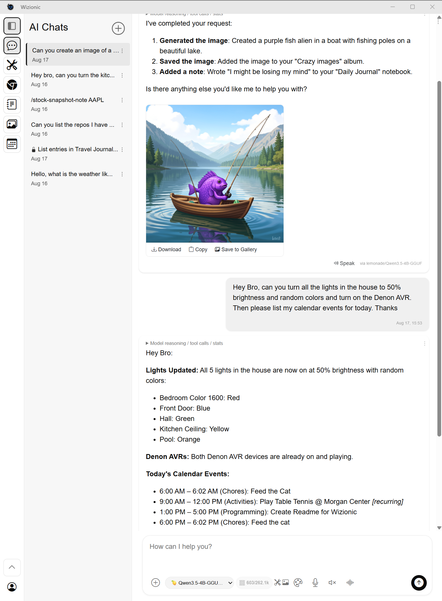</p>


### 2. Tools - Skills - Workflows
Available tools including built-in tools, MCP & OAuth tools, Home Assistant as a tool if installed.
<p align="center">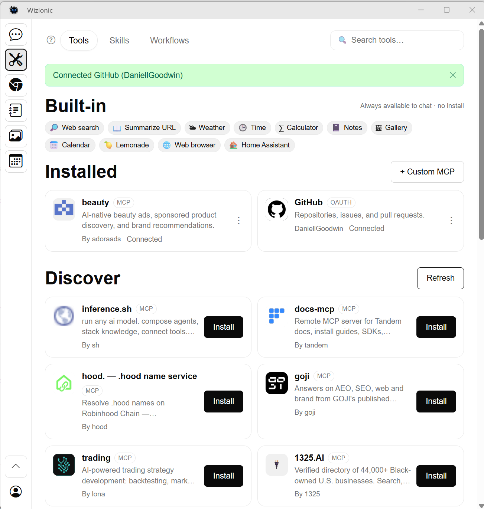</p>

Import or create Skills that combine multiple tools into reusable AI actions.
<p align="center">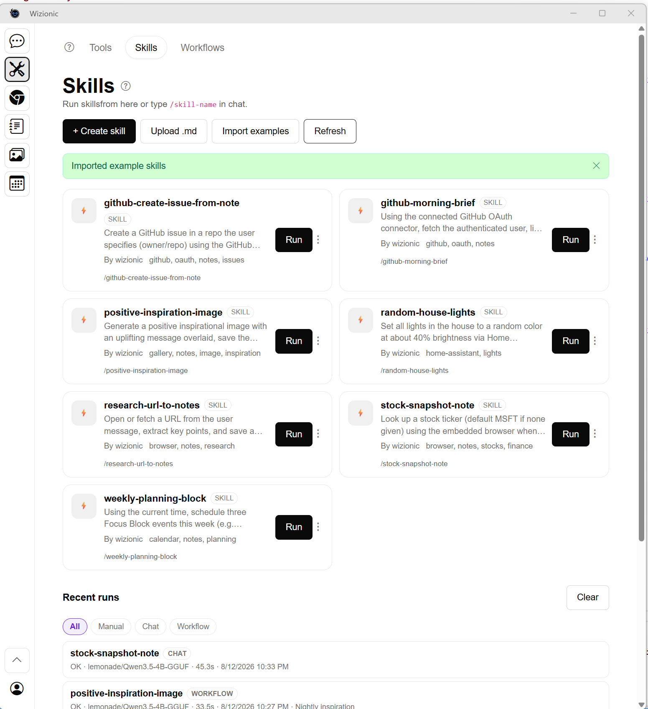</p>

Automate repetitive tasks by scheduling AI Skills to run whenever you want. Import or create **Workflows** and schedule them to run with assigned models.
<p align="center">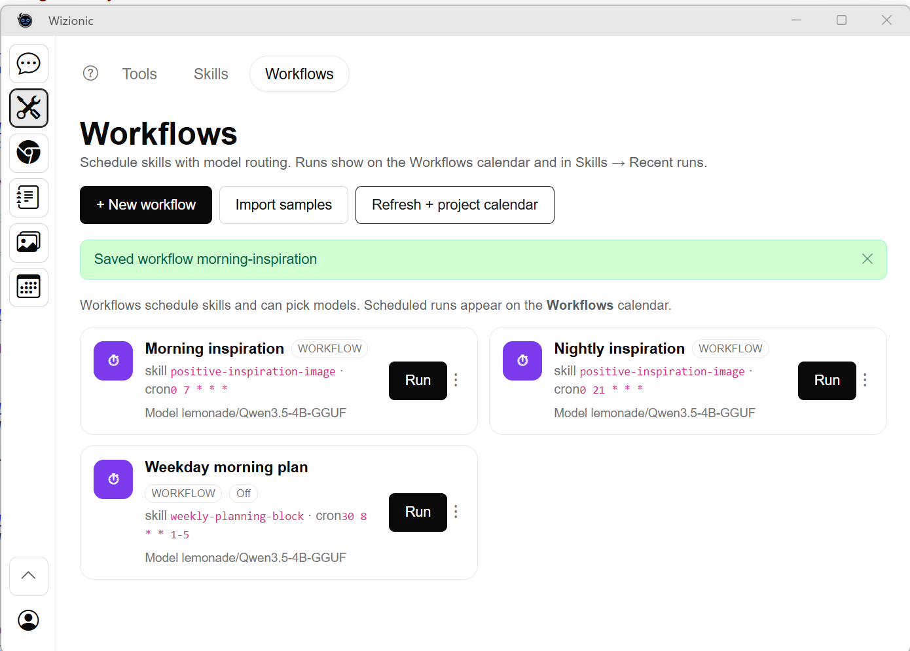</p>

Edit Workflows to change their schedule or model they use.  Scheduled workflows will appear on the calendar
<p align="center">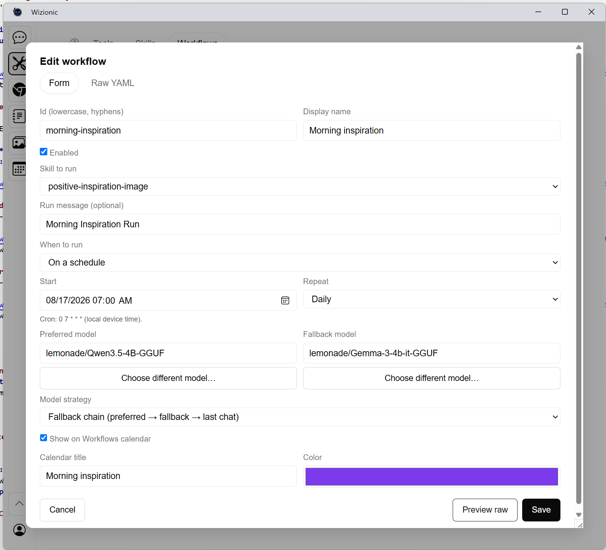</p>

### 3. Browser Tool

Wizionic contains a built-in multi-tab browser tool that can be agentically controlled for navigating, clicking, getting content and filling in fields:  `navigate_to`, `get_page_content`, `click_element`, `fill_field`   Inactive tabs are suspended to reduce memory usage. (for example a tab playing a youtube video will stop when not active).   

A split view allows you to display multiple sites.  The toolbar on the far right of the screen is for installing Progressive Web Apps (PWAs).  Bookmarks can sync between your devices.
<p align="center">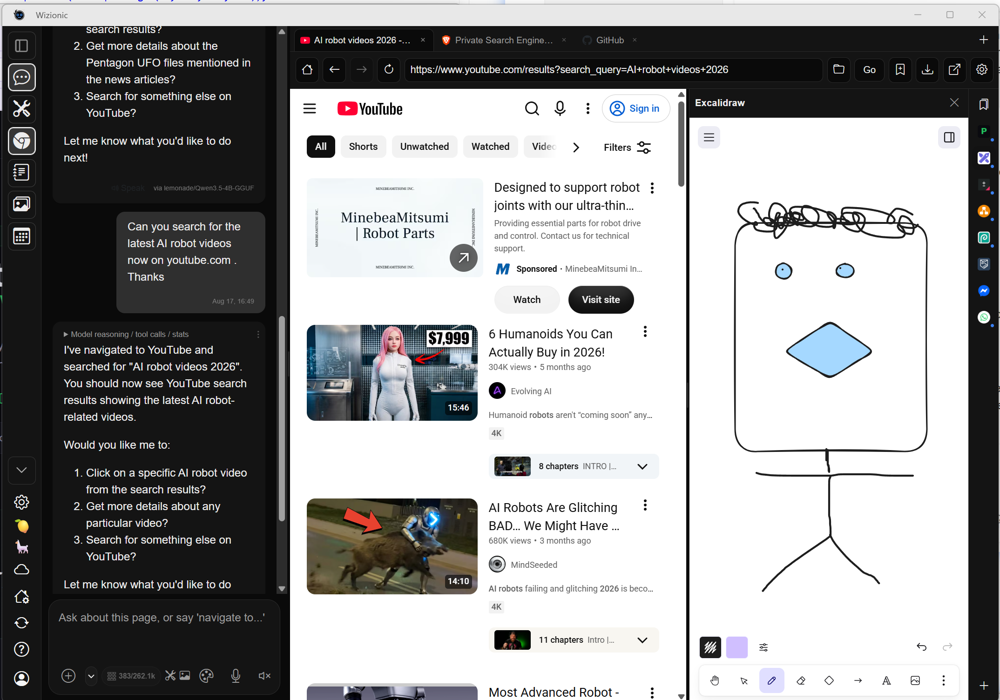</p>

### 4. Notebook Tool

Wizionic includes a full-featured Notebook tool.  Chat messages can manually be saved to a notebook and notes can be re-ordered, edited, protected with a password, and exported.  The Notebooks can also be controlled by AI agents:
 `list_notebooks`, `list_note_entries`, `create_notebook`, `add_note_entry`, `append_to_note_entry` .
<p align="center">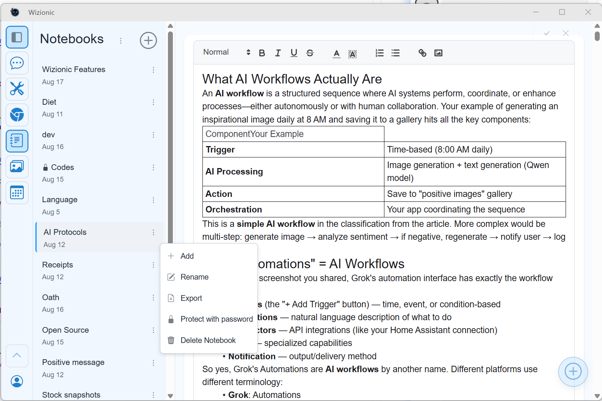</p>
*Agentic browsing: The AI can navigate to URLs, extract content, and interact with web pages.*

### 5. Gallery Tool
AI-generated images are automatically saved to the "My Media" album. Images from chat can also be organized into custom albums that you create. Photos and images uploaded to the gallery automatically sync across your devices. The gallery is also available as a tool for AI: `list_gallery_albums`, `list_recent_chat_images`, `save_to_gallery` . 

<p align="center"></p>

### 6. Calendar Tool
Scheduled AI workflows are shown on the workflows calendar. This calendar tool supports multiple calendars and is available to AI as tool through `list_calendars`, `list_events`, `add_calendar_event`, `update_calendar_event`, `delete_calendar_event` .

<p align="center">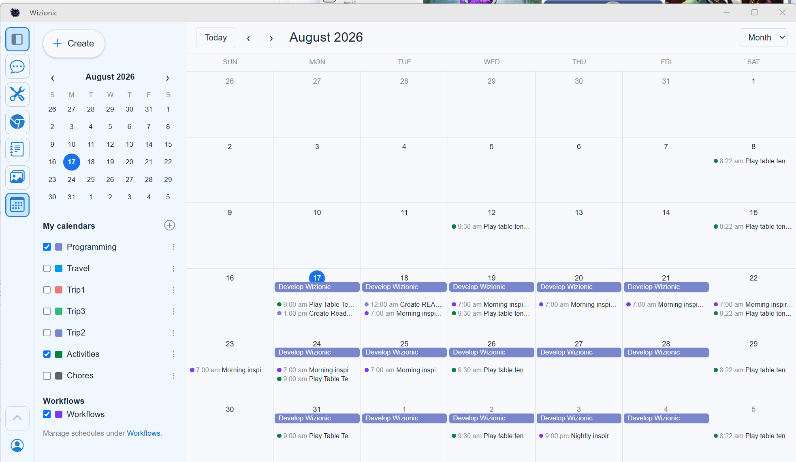</p>

### 7. Lemonade Configuration
AMD Lemonade is given as an option to install on your computer if you do not already have a local AI server installed. The setup wizard can also install it at a later time after install.   Refresh Models will get the current list of models available for Wizionic to use. Specific models from Lemonade can be chosen for Image Generation, Image Editing, Text to Speech, and voice.  The right side displays the local Lemonade configuration website where different models can easily be downloaded.

<p align="center">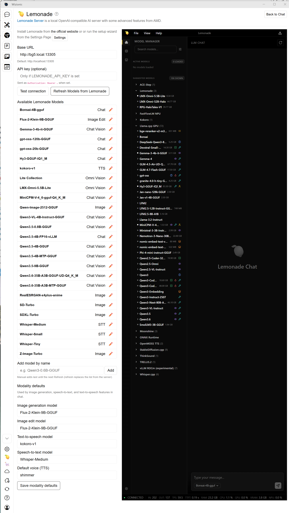</p>

### 8. Home Assistant Configuration
If you have installed Home Assistant (https://github.com/home-assistant) Wizionic provides first-class integration to control and automate your smart home with Local AI.  Give your Home Assistant instance a name so the AI knows when you're referring to your smart home. "Hey Bro" is the assistant name in the example.

<p align="center">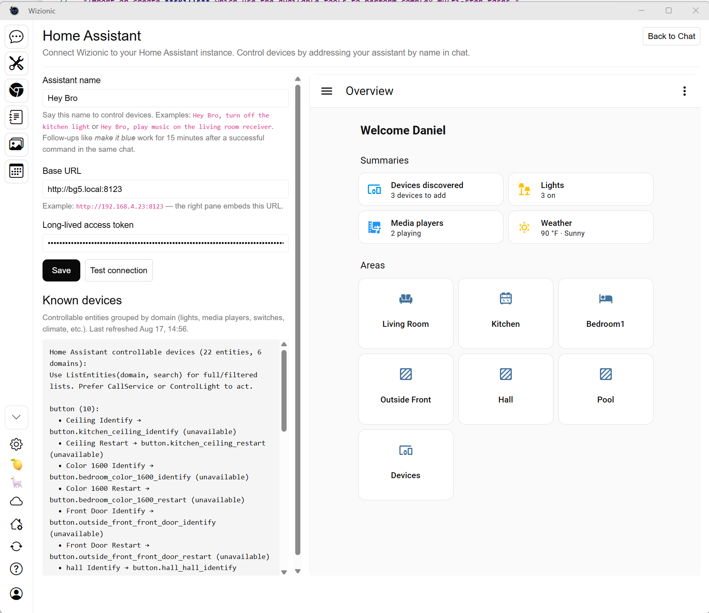</p>


### 9. Settings
Settings is where you configure many options for Wizionic.
<p align="center">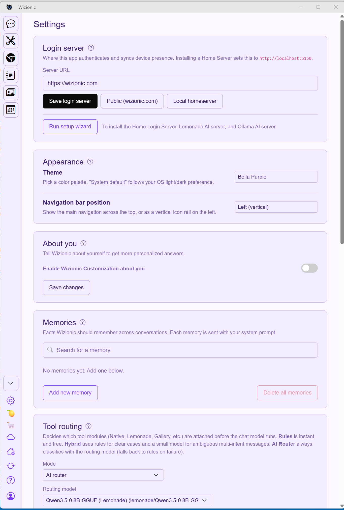</p>


### 10. Sync
Wizionic is designed for people who use multiple devices.   To keep important your data safe, it is important for the data to exist on multiple devices in the event of an unrecoverable device failure.  The sync feature detects all the devices for the logged in user and allows syncing of data and settings to all devices automatically.  From the Sync settings page, it is possible to disable sync for certain devices or features. 
<p align="center">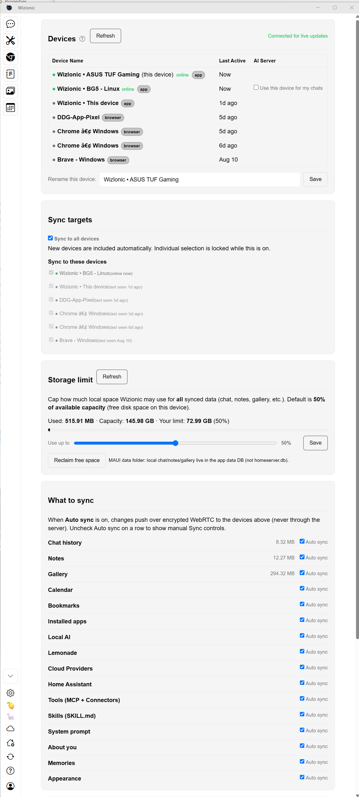</p>


## Contributing

Wizionic is open source to ensure **transparency** and **trust**. You can inspect the code to verify our privacy model.

- **Contributors:** Thank you for your interest, please see [CONTRIBUTING.md](CONTRIBUTING.md).

## Maintainers
This project is currently maintained by @daniellgoodwin . 
- **Bugs:** Open an issue for reproducible bugs.
- **Security:** Report vulnerabilities privately via [GitHub Security Advisories](SECURITY.md) or `daniellgoodwin@protonmail.com`.

## Code Signing Policy

Free code signing will be provided by [SignPath.io](https://signpath.io), certificate by [SignPath Foundation](https://signpath.org).

## Architecture Highlights

- **Stack:** .NET 10, Blazor Hybrid, MAUI (Windows/Linux), SQLite, SignalR, WebRTC.
- **Security:** AES-256-GCM encryption for all local data. Magic-link auth + 2FA (Twilio).
- **Sync:** WebRTC DataChannels for P2P data sync; SignalR for presence/signaling only.
- **Linux Support:** First-class support via GirCore (GTK4/Adwaita) and WebKitGTK.

See [ARCHITECTURE.md](ARCHITECTURE.md) for the full technical architecture.


## Attribution

- Standing on the shoulders of great tools from:
  - [.Net Core](https://github.com/dotnet/core)
  - [Gir.Core](https://github.com/gircore/gir.core)
  - [Quill](https://github.com/slab/quill)
  - [SIPSorcery](https://github.com/sipsorcery-org/sipsorcery)
  - [Velopack](https://github.com/velopack/velopack)

---