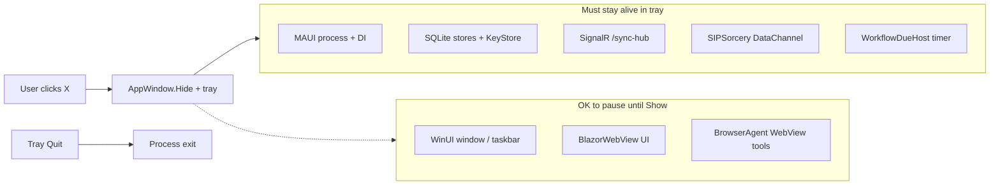
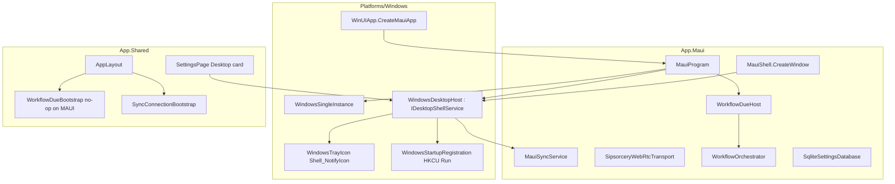

# Windows MAUI close-to-system-tray (Wizionic)

| Field | Value |
|-------|--------|
| **Author** | TBD |
| **Date** | 2026-08-21 |
| **Status** | Draft |
| **Scope** | Windows MAUI desktop (`net10.0-windows10.0.19041.0`, unpackaged) |
| **Related** | [`ARCHITECTURE.md`](ARCHITECTURE.md), [`planSystemTray.md`](planSystemTray.md), [`Agents.md`](Agents.md) |

---

## Overview

Wizionic’s Windows MAUI app currently **exits the process when the user closes the window**. That kills two things users expect to keep running: **WebRTC peer sync** (`MauiSyncService` + `SipsorceryWebRtcTransport`) and **device-local scheduled workflows** (`IWorkflowOrchestrator`, ticked today by a Blazor component). The Home Server Windows Service can stay up independently, but it does **not** hold chat/note bodies, run skills, or accept DataChannel payloads.

This design treats the desktop app as a **long-lived agent process**. Closing the *window* hides it to a **system tray icon**; **Quit** (tray menu, or Settings) is the only path that tears down DI, SignalR, WebRTC, and the workflow loop. A process-level due ticker replaces the Blazor-only loop so due runs fire while the window is hidden even if the WebView2 circuit throttles. Optional **Start with Windows** plus **start minimized** keep the agent alive across logon.

WASM, iOS/Android, multi-step DAGs, and a headless Windows Service workflow runner are **out of scope**. **Linux tray is sketched as a future tier** (GirCore / StatusNotifierItem, §12 / PR 6) and must **not** ship in the Windows PRs.

---

## Background & Motivation

### Current state (verified in code)

| Area | Today |
|------|--------|
| Tray / NotifyIcon | **None.** No `NotifyIcon`, `TrayIcon`, `Shell_NotifyIcon`, `CloseRequested` cancel, mutex, or single-instance. |
| Window | `MauiShell.CreateWindow` in [`App.Maui/App.xaml.cs`](App.Maui/App.xaml.cs): MAUI `Window` + WinUI `TitleBar` + `AppWindow.SetIcon` from `appicon.ico`. |
| WinUI entry | [`App.Maui/Platforms/Windows/App.xaml.cs`](App.Maui/Platforms/Windows/App.xaml.cs) `WinUIApp : MauiWinUIApplication` → `MauiProgram.CreateMauiApp()`. |
| Packaging | Unpackaged (`WindowsPackageType` None), TFM `net10.0-windows10.0.19041.0`, self-contained Release `win-x64`. Icon copied to output as `appicon.ico`. |
| Workflow due ticker | [`App.Shared/Components/WorkflowDueBootstrap.razor`](App.Shared/Components/WorkflowDueBootstrap.razor): ~8 s delay then 1 min loop of `ProjectCalendarsAsync` + `ProcessDueAsync`. Mounted from [`App.Shared/Layout/AppLayout.razor`](App.Shared/Layout/AppLayout.razor). |
| Orchestrator | Singleton `IWorkflowOrchestrator` → `WorkflowOrchestrator` in `MauiProgram.RegisterAppServices`. WASM is scoped; host uses `NullWorkflowOrchestrator`. |
| Sync | Singletons `MauiSyncService` + `SipsorceryWebRtcTransport`. Hub started from Blazor [`SyncConnectionBootstrap.razor`](App.Shared/Components/SyncConnectionBootstrap.razor) after `IAuthService.LoadAsync`. SignalR has `.WithAutomaticReconnect()`. Transport is **pure C#** (SIPSorcery), not JS/`RTCPeerConnection`. |
| Updates | `VelopackApp.Build().Run()` is the **first** call in `CreateMauiApp`. `MauiUpdateService.DownloadAndInstallAsync` → `ApplyUpdatesAndRestart`. Uninstall FastCallback already `sc.exe stop WizionicHomeServer`. |
| Settings persistence | Mix of JS `localStorage` (theme, nav layout) and SQLite `SqliteSettingsDatabase` (`wizionic_local.db` under `FileSystem.AppDataDirectory`). Device-id / device-name are **unprefixed** SQLite keys. User settings use `StorageNamespace` prefixes via `ISyncPreferencesStore`. |

### Pain points

1. **Close = quit.** Taskbar X / Alt+F4 destroy the process. Other devices cannot sync to this PC; cron workflows do not fire.
2. **Due ticker is circuit-coupled.** `WorkflowDueBootstrap` is a Razor component. A hidden/throttled WebView2 (or a circuit recycle) can stall `Task.Delay`. There is **no** `IHostedService` / `PeriodicTimer` anywhere in the repo.
3. **Sync start is Blazor-coupled.** `SyncConnectionBootstrap` runs in `OnInitializedAsync`. Start-minimized / slow WebView2 can delay presence even though `MauiSyncService` itself has no UI dependency.
4. **No single-instance.** A second Start-menu launch would create a second process (second hub registration, second SQLite writers, second tray icon).
5. **Minimized-to-taskbar already works** for workflows/sync (process alive). Users still “close” the app out of habit. Tray is the product fix; moving the ticker off Blazor is the reliability fix even without tray.

### Architectural principle (from `planSystemTray.md`)

> Closing the *window* ≠ killing the *process*. Most tools are **process-coupled**, not window-coupled. Browser-agent tools need WebView; they can wait until the window is shown again. Sync and most skills need the process + DI + unlocked keys.



---

## Goals & Non-Goals

### Goals

1. **Close → hide to tray** (default on Windows): cancel WinUI close, hide `AppWindow`, keep process / BlazorWebView / DI / SignalR / WebRTC.
2. **Tray icon** using `appicon.ico`, context menu **Show** / **Quit**, tooltip (and a one-time balloon).
3. **Quit** really exits: stops workflows, hub, DataChannels; removes tray icon.
4. **Single-instance**: second launch activates the existing window (or unhides from tray).
5. **Process-level workflow ticker** on MAUI so due runs fire while hidden; WASM keeps `WorkflowDueBootstrap`; Linux GirCore must not regress (it should **gain** the same process ticker).
6. **Sync stays connected** while hidden; reconnect on restore / resume if dropped.
7. **Start with Windows** + **start minimized** (login launch only).
8. **Velopack** restart restores tray vs window consistently; uninstall removes the Run key; existing homeserver-stop callback stays.
9. **Settings UI** for close-to-tray / start-with-Windows / start-minimized; device-local persistence; not synced.
10. **Docs**: `ARCHITECTURE.md` + user help (`docs/user/settings.md`, `skills-workflows.md`, `sync.md`).
11. **Manual test plan** (no new test project).

### Non-goals

- Multi-step workflow DAGs.
- Headless agent / Windows Service workflow runner.
- Homeserver-as-workflow-engine (fights local-first; encrypted bodies and KeyStore live on the client).
- **Linux tray implementation** in PRs 1–5 (Windows-only merge train). A **future-tier sketch** is in §12 / PR 6; do not mix it into the Windows PRs.
- iOS/Android background execution.
- Catch-up of **every missed cron minute** after long sleep (**resolved:** keep current-minute `CronExpression.IsDue`; no backfill).
- Changing WASM/PWA background behavior.
- New telemetry/metrics backend.

---

## Key Decisions

| # | Decision | Rationale |
|---|----------|-----------|
| K1 | **Close-to-tray default ON** for Windows MAUI (first tagged Windows release); user can disable in Settings. Tray **Quit** always exists. | Product decision. Slack/Discord-style. First hide shows a one-time balloon so it is not silent. |
| K2 | **Tray via P/Invoke `Shell_NotifyIcon` + `NIF_GUID`**, not H.NotifyIcon and not a first-party WASDK TrayIcon. | Zero extra NuGet; three-item menu is enough for Win32 `TrackPopupMenu`. **GUID is the tray identity** so a new process can `NIM_ADD` over a **dead HWND** after crash/kill (identity is GUID, not `hWnd+uID`). It does **not** migrate an icon across binary-path changes — MS Learn states the binary path is part of GUID registration; if the path changed you must `NIM_DELETE` and re-add. Velopack 1.2 keeps the real exe at `{root}\current\Wizionic.exe`, so the path is stable across updates. If GUID `NIM_ADD` fails (stale registration), `NIM_DELETE` then add again; optional non-GUID `uID` fallback. Frozen GUID `{8C3E1A6B-4F72-4D9A-9B1E-7A0C2E5D91F4}`. H.NotifyIcon has had WinUI windowless crash reports; WASDK has no first-party tray API. |
| K3 | **Single-instance = named mutex + named EventWaitHandle**, not `AppInstance` as the only path. | Unpackaged `WindowsPackageType=None`. `Package.appxmanifest` protocol entries are **not** the unpackaged identity. Mutex+event is reliable for “second Start-menu click”. Treat `AbandonedMutexException` as acquired. Start the wait loop **after Attach**; marshal `Show()` to the `DispatcherQueue` captured there. Do not use `Global\`. |
| K4 | **Workflow due loop moves to `WorkflowDueHost` (MAUI singleton)** started after **every** `MauiApp.Build()` / `CreateLinuxServiceProvider()`. `WorkflowDueBootstrap` no-ops when `AppEnvironment.IsMaui`. | `SetMaui()` runs for Windows, Android, iOS, Mac Catalyst, **and** Linux GirCore. Gating the Razor loop on `IsMaui` is only safe if `WorkflowDueHost.Start()` runs on **all** of those TFMs (not `#if WINDOWS` only). Mobile: same process ticker, **no tray** (non-goal, but must not silently lose due runs). WASM does not call `SetMaui()` and keeps the Razor loop. |
| K5 | **Do not use `IHostedService`.** Use an explicit `Start()` on a singleton. | Avoid a false sense that the generic host will run the loop. Call `Start()` from **both** `CreateMauiApp()` (every TFM: Windows / Android / iOS / Mac Catalyst) **and** `CreateLinuxServiceProvider()`. |
| K6 | **Tray/desktop prefs live in `SqliteSettingsDatabase` unprefixed keys**, not `IKeyStore`, not JS localStorage, **not** WebRTC settings sync. | Must be readable **before** Blazor starts (start-minimized, close-to-tray on `AppWindow.Closing`). Device-local (like `app-device-id`). Syncing “close to tray” to WASM/Linux is meaningless. |
| K7 | **Start with Windows = HKCU Run** pointing at the Velopack **root execution stub** (quoted): `"%LocalAppData%\Wizionic\Wizionic.exe"` plus `--start-minimized` when that setting is on. Debug/unpackaged: `Environment.ProcessPath` with the same arg. **Not** Squirrel `--processStart` / `--processStartArgs`. | Velopack **1.2** (`App.Maui.csproj`) installs a **stable** tree: `{root}\current\Wizionic.exe`, `{root}\Update.exe`, `{root}\Wizionic.exe` stub. The stub is what shortcuts/launchers are supposed to use; it survives updates. Official updater CLI is `update.exe start [EXE_NAME] [-- [EXE_ARGS]...]` — we do **not** use that for the Run key (see Alternatives H). HKCU Run is user-scoped (DPAPI/KeyStore). Quote the entire command. Resolve stub as `Path.GetFullPath(Path.Combine(AppContext.BaseDirectory, "..", "Wizionic.exe"))` when `BaseDirectory` ends with `\current\`. |
| K8 | **`--start-minimized` is only passed by the Run key.** Clicking the app in Start/taskbar **always shows the window.** | Users who click the icon want UI. Auto-start at logon is the “agent in tray” path. Incomplete onboarding **always shows** the window. |
| K9 | **X / Alt+F4 / WinUI close = hide** (if toggle on). **Tray Quit** and **Settings → Quit Wizionic** = process exit. **No Quit confirm dialog in v1.** | Power users need a real stop. Balloon / Settings copy is the hint. Confirm-on-Quit is out of v1. |
| K10 | **Update-available while hidden → `Show()`** and reuse `AppUpdateBootstrap` / Settings dialog. Do not invent a second update UX. Persist `{hidden:true}` in app data so Velopack restart can return to tray. | Existing ConfirmDialog is Blazor. Hidden window can still have a live WebView; restoring is the smallest change. |
| K11 | **Sync is started from C# on MAUI** (`IAuthService.LoadAsync` + `ISyncService.InitializeAsync` / `EnsureConnectedAndRegisteredAsync`) in the **same PR that can hide the window** (PR 2), not deferred until after start-minimized. | `SyncConnectionBootstrap` only runs after first Blazor render. Hiding before the circuit starts (PR 4 `--start-minimized`, or even PR 2 X-to-tray before WebView2 paints) would miss presence. `InitializeAsync` is already idempotent (`_initialized`). Bootstrap still owns `AuthService.OnChanged` for login-while-running. |
| K12 | **Browser-agent tools stay window-coupled.** Skills that need `BrowserAgent` while tray-resident may fail until Show (panel + WebView). Sync, notes, calendar, HA HTTP, MCP, Lemonade/Ollama HTTP work in the background. | Matches `MauiBrowserContext.IsAvailable => _panel.IsOpen && _agent.IsAvailable`. Do not auto-open the browser panel in the tray. |
| K13 | **Do not change `CronExpression.IsDue`.** Resume still calls `ProcessDueAsync` immediately; **missed cron slots after sleep are not backfilled** (current-minute only). `once` triggers already catch up (`now >= slot && LastRunAtUtc is null`). | Product decision. Stampede risk if a weekend of slots fired on wake. |
| K14 | **Linux tray is future-tier only (PR 6).** Windows PRs 1–5 must not add SNI, Ayatana, or Linux hide-on-close. `WorkflowDueHost` still starts on Linux from PR 1. | Product: sketch now, implement later. Same close≠quit idea; different OS chrome (`Gtk.Window.OnCloseRequest`, StatusNotifierItem, XDG autostart). |

---

## Proposed Design

### Component map



### Lifecycle

```mermaid
sequenceDiagram
  participant User
  participant WinUI as AppWindow
  participant Host as WindowsDesktopHost
  participant Tray as WindowsTrayIcon
  participant Due as WorkflowDueHost
  participant Sync as MauiSyncService

  Note over Host,Sync: Process start (Velopack callbacks already ran)
  Host->>Due: Start()
  Host->>Sync: Initialize + EnsureConnected (if authed)
  Host->>Tray: NIM_ADD (GUID + appicon.ico)
  alt --start-minimized and onboarding complete
    Host->>WinUI: Hide()
  else
    Host->>WinUI: Show()
  end

  User->>WinUI: Click X / Alt+F4
  WinUI->>Host: AppWindow.Closing
  alt CloseToTray && !QuitRequested
    Host->>WinUI: Cancel=true; Hide()
    Host->>Tray: NIM_MODIFY tooltip; one-time balloon
    Note over Due,Sync: Process stays; ticker + hub keep running
  else
    Host->>Tray: NIM_DELETE
    Host->>Due: Stop()
    Host->>Sync: DisposeAsync
    Host->>WinUI: allow close / Application.Quit
  end

  User->>Tray: Show
  Tray->>Host: Show()
  Host->>WinUI: Show + Activate
  Host->>Due: ProcessDueAsync now
  Host->>Sync: RefreshAsync / EnsureConnected

  User->>Tray: Quit
  Tray->>Host: RequestQuit()
```

---

### 1. Close → hide to tray

**Hook:** `Microsoft.UI.Windowing.AppWindow.Closing` (cancellable). WinUI `Window.Closed` is **not** cancellable ([MS Learn: app state / AppWindow.Closing](https://learn.microsoft.com/en-us/windows/apps/develop/performance/state-management)).

Wire this in the existing `OnWindowsWindowCreated` path in [`App.Maui/App.xaml.cs`](App.Maui/App.xaml.cs) (already resolves HWND → `AppWindow` for `SetIcon`). After `appWindow.SetIcon`, call `_desktop.Attach(window, appWindow)` on the injected `WindowsDesktopHost` (`#if WINDOWS`). `Attach` is **not** on `IDesktopShellService`.

```csharp
// WindowsDesktopHost.OnAppWindowClosing
private void OnClosing(AppWindow sender, AppWindowClosingEventArgs args)
{
    if (_quitRequested || !CloseToTray)
        return; // allow process exit

    args.Cancel = true;
    HideToTray();
}
```

`HideToTray()`:

1. `appWindow.Hide()` — removes from taskbar (not minimize). This **will** raise MAUI `Window.Stopped` (mapped from WinUI `VisibilityChanged`). That is **not** quit.
2. Leave MAUI `Window`, `MainPage`, `BlazorWebView`, extra `WebView`s (`browserWebView`, `browserSideWebView`, `urlEmbedWebView`) **alive**. Do **not** navigate away or dispose the circuit.
3. `IsHidden = true`; raise `OnChanged` for Settings.
4. First successful hide: attempt balloon “Wizionic is still running. Right-click the tray icon to Quit.” Persist `app-tray-hint-shown=1` **only** after a successful balloon **or** after the user opens the Settings Desktop card (Windows 11 / Focus Assist often suppress `NIF_INFO`). Do not set the flag on a hide that never showed the hint.
5. Update tooltip (Connected/Offline only).

**Do not** handle MAUI `Window.Destroying` as the hide path — it is too late (MAUI maps Destroying → WinUI `Closed`, which is not cancellable).

**Task Manager “End task”** cannot be cancelled; process dies. Document that.

**Lifecycle invariant (must not treat hide as quit):**

| Event | Source | Tray-resident action |
|-------|--------|----------------------|
| `AppWindow.Closing` | Caption X, Alt+F4, custom MAUI `TitleBar` X | If `CloseToTray && !_quitRequested`: `Cancel=true`, `HideToTray()`. Else allow close. |
| `Window.Stopped` / WinUI `VisibilityChanged` | `AppWindow.Hide()` | **Ignore** for workflows/sync/due host. Do **not** disconnect hub, stop `WorkflowDueHost`, or clear browser. |
| `Window.Resumed` / Show | Tray click, second instance, update prompt | `TickNowAsync()` + `ISyncService.RefreshAsync()`. |
| `Window.Destroying` / WinUI `Closed` | Real close | Only reached when `Closing` was **not** cancelled (`_quitRequested` or CloseToTray off). |
| `MainPage.OnPageUnloaded` | Today calls `BrowserWebViewPlatformService.ApplyClearOnExitAsync()` | Guard with `_quitRequested` (or `IDesktopShellService` equivalent). **Must-pass test:** Hide must **not** unload `MainPage` or clear the embedded browser. If Hide ever unloads the page, that is a bug — do not “fix” it by running clear-on-exit. |
| Custom `window.TitleBar` X | Already set in `MauiShell.CreateWindow` | Verify in test A that it still routes through `AppWindow.Closing`. |

**MAUI quit-on-last-window:** because `Closing` is cancelled, `Closed`/`Destroying` should not run, so `MauiWinUIApplication` should not exit. Verify in manual tests (“X then wait 30s”).

**R1 fallback (only if tests prove the process still exits):** do **not** introduce a second dummy window first. Keep the hidden `AppWindow` (already the HWND) and/or `ConfigureLifecycleEvents` Windows `OnClosed` as a no-op while `!_quitRequested`. A dummy window is last resort and out of v1 unless R1 reproduces.

**`Attach` is not on `IDesktopShellService`.** Keep `Attach(Window window, AppWindow appWindow)` **internal** on `WindowsDesktopHost`. `MauiShell` under `#if WINDOWS` injects `WindowsDesktopHost` (registered as itself **and** as `IDesktopShellService`). Convert `OnWindowsWindowCreated` / `ApplyWindowsAppWindowIcon` from **static** to **instance** handlers so they can call `_desktop.Attach(window, appWindow)` after `SetIcon`. Non-Windows `MauiShell` ctor stays OAuth-only.

---

### 2. Tray icon

**New files (Windows TFM only, MAUI SingleProject already compiles `Platforms/Windows/**` only on Windows):**

| File | Role |
|------|------|
| `App.Maui/Platforms/Windows/NativeMethods.cs` | `Shell_NotifyIcon`, `NOTIFYICONDATAW`, `ExtractIconEx` / `LoadImage`, `TrackPopupMenu`, `WM_TASKBARCREATED`, `GetCursorPos` |
| `App.Maui/Platforms/Windows/WindowsTrayIcon.cs` | Add/modify/delete icon, tooltip, balloon, context menu, click handlers |
| Reuse | `MauiShell.ResolveWindowsIconPath()` — **move** to `App.Maui/Platforms/Windows/WindowsIconPath.cs` so tray and `SetIcon` share candidates (`appicon.ico` next to exe, `Resources/AppIcon/appicon.ico`, repo-relative debug path) |

**HWND scheme (A — required):** subclass the **existing WinUI HWND** already obtained in `OnWindowsWindowCreated` via `SetWindowSubclass`. Use that HWND as `NOTIFYICONDATA.hWnd`.

- Message-only `HWND_MESSAGE` windows **do not receive broadcast messages**. Explorer restart sends `TaskbarCreated` as a **broadcast**, so a message-only owner would fail test H.
- `TrackPopupMenu` from a message-only owner is also a known footgun. Do not use scheme B/C unless subclassing the WinUI HWND proves unworkable (then a hidden 0×0 **top-level** unowned window that can receive broadcasts — not `HWND_MESSAGE`).

**NOTIFYICONDATA:**

- `uFlags = NIF_MESSAGE | NIF_ICON | NIF_TIP | NIF_GUID` (and `NIF_INFO` for the one-time balloon).
- **Stable GUID** (never change): `{8C3E1A6B-4F72-4D9A-9B1E-7A0C2E5D91F4}` — documented in code. Identity vs dead HWND after crash/kill, **not** path migration (K2).
- `uCallbackMessage = WM_APP + 0x440`.
- After `NIM_ADD`, call `NIM_SETVERSION` with `NOTIFYICON_VERSION_4`. Handle **v4** messages only (do not mix with classic):
  - `NIN_SELECT` / `NIN_KEYSELECT` → `Show()`
  - `WM_CONTEXTMENU` → popup at `GetCursorPos()` (or `lParam` coords)
- If `NIM_SETVERSION` fails, fall back to classic `WM_LBUTTONUP` / `WM_RBUTTONUP` on the same subclass proc — one version at a time, never both.
- **Add retry:** if GUID `NIM_ADD` fails, `NIM_DELETE` then `NIM_ADD` again. Optional last-resort: drop `NIF_GUID` and use a fixed `uID`.
- Tooltip: `Wizionic — Connected` / `Wizionic — Offline` (from `ISyncService.IsConnected`). Classic 128-char tip; no note titles.
- Right-click / `WM_CONTEXTMENU` Win32 popup:
  - **Show Wizionic**
  - separator
  - **Quit**
- **Menu trick:** `SetForegroundWindow(hWnd)` before `TrackPopupMenu`; `PostMessage(hWnd, WM_NULL, 0, 0)` after so the menu dismisses correctly.
- Subclass also handles `RegisterWindowMessage("TaskbarCreated")` → `NIM_ADD` again (Explorer restart). Same HWND receives the broadcast.

**Why not H.NotifyIcon:** extra dependency, WinUI `MenuFlyout` host window, historical windowless crashes, and it still wraps `Shell_NotifyIcon`. Three menu items do not justify it.

**Why not WASDK TrayIcon:** no first-party tray control in the Windows App SDK used by MAUI 10; community samples still P/Invoke.

**Icon lifetime:** create in `Attach` after first `AppWindow` exists; `NIM_DELETE` in `PrepareForProcessExit` / `RequestQuit` and in dispose. Unsubclass on quit.

---

### 3. Quit vs close

| Gesture | Close-to-tray ON (default) | Close-to-tray OFF |
|---------|----------------------------|-------------------|
| Taskbar X | Hide to tray | Process exit |
| Alt+F4 | Hide to tray | Process exit |
| Tray **Quit** | Process exit | Process exit |
| Settings **Quit Wizionic** | Process exit | Process exit |
| `IAppRestartService.Restart` / Velopack `ApplyUpdatesAndRestart` | Process exit (then new process) | same |
| End task | Process exit | Process exit |

`RequestQuit()` (user Quit only):

1. `_quitRequested = true`.
2. Persist nothing extra (prefs already saved on toggle).
3. `PrepareForProcessExit()` (tray `NIM_DELETE` + unsubclass; `WorkflowDueHost.Stop()`).
4. Best-effort `ISyncService.DisposeAsync()` (already stops hub / coordinator in [`MauiSyncService.DisposeAsync`](App.Maui/Services/MauiSyncService.cs)).
5. `Application.Current?.Quit()` (MAUI) falling back to `appWindow.Destroy()` / `Environment.Exit(0)` if Quit does not terminate.

`PrepareForProcessExit()` is the **tray/ticker teardown without `Application.Quit()`**. Restart/update **must** call this, **not** `RequestQuit()` — `Quit()` would race the newly spawned process.

**DI cycle break:** `WindowsDesktopHost` must **not** inject `IUpdateService`, and `MauiUpdateService` must **not** inject `IDesktopShellService` (ctor cycle).

- `MauiUpdateService.DownloadAndInstallAsync` and `MauiAppRestartService.Restart` resolve `IDesktopShellService` **inside the method** via `IServiceProvider.GetService<IDesktopShellService>()` and call `PrepareForProcessExit()` **before** `ApplyUpdatesAndRestart` / `Process.Start` + `Environment.Exit(0)`.
- `WindowsStartupRegistration` takes `bool isVelopackInstalled` (and paths) as **method arguments at save time**, not a host ctor dependency on `IUpdateService`. Settings toggle reads `IUpdateService.IsVelopackInstalled` from the page/host method, then calls `Apply(startWithWindows, startMinimized, isVelopackInstalled)`.

**Settings:** a button **Quit Wizionic** in the Desktop card (destructive outline), not only the tray, so keyboard-only users can exit after disabling close-to-tray.

---

### 4. Single-instance

**When:** immediately after `VelopackApp.Build()...Run()` in [`MauiProgram.CreateMauiApp`](App.Maui/MauiProgram.cs), **before** `MauiApp.CreateBuilder()`. Velopack must be able to run first-run/update/uninstall callbacks in a short-lived process without fighting the mutex.

```csharp
VelopackApp.Build() /* existing callbacks */ .Run();
#if WINDOWS
if (!WindowsSingleInstance.TryAcquirePrimary())
{
    WindowsSingleInstance.RequestShow();
    Environment.Exit(0);
}
#endif
```

**Implementation** (`App.Maui/Platforms/Windows/WindowsSingleInstance.cs`):

- Mutex name: `Local\Wizionic.Desktop.SingleInstance` (per-user session; do **not** use `Global\`).
- Auto-reset events:
  - `Local\Wizionic.Desktop.Activate` — second launch → Show
  - `Local\Wizionic.Desktop.Quit` — uninstall FastCallback → primary `PrepareForProcessExit` + exit
- **Abandoned mutex:** `TryAcquirePrimary()` must `catch (AbandonedMutexException)` and treat it as **acquired** (primary). Tray-resident kill (Task Manager, Velopack replacing `current\`) leaves the mutex abandoned; without this the next launch thinks it is secondary and exits, leaving the user with no app.
- **Wait loop starts only after `Attach`:** `IDesktopShellService` / `AppWindow` do not exist at mutex time. Auto-reset events stay signaled until waited, so a second launch during startup is not lost if the wait begins at Attach. Starting the wait at mutex time and calling `Show()` before Attach **would** drop the first activation.
- **UI thread:** capture `Microsoft.UI.Dispatching.DispatcherQueue` in `Attach`. The wait loop is a background thread. **All** `AppWindow` / tray mutations (`Show`, `HideToTray`, `NIM_*`, menu) marshal to that queue (`TryEnqueue`). `Show()` on the public interface is `void` but **must** marshal; Settings (Blazor) and `Closing` (UI) also call in — enqueue is idempotent if already on the queue.
- Secondary: `RequestShow()` sets the Activate event, mutex not acquired, `Environment.Exit(0)` **without** building DI.

**OAuth / `wizionic://`:** `Package.appxmanifest` protocol entries **do not apply** to `WindowsPackageType=None`. There is **no** HKCU `Software\Classes\wizionic` registration in the repo. In-app OAuth is `MauiOAuthInterceptor` watching `/api/oauth/done` (MAUI WebView cannot reliably open `wizionic://`). Mutex collapsing a second exe is still correct (SQLite). There is **nothing to forward today** — do not imply unpackaged protocol currently lands on the primary. **Follow-up only if** we later register the protocol unpackaged: write the URI to `MauiAppData.Directory/pending-applink.txt` then signal Activate; primary reads and calls `_oauthReturn.SetFromUri`. Non-blocking for tray PRs.

**SQLite:** two processes writing `wizionic_local.db` is unsafe. Single-instance is a **correctness** requirement, not a nicety.

---

### 5. Workflow ticker (Tier 1)

**New:** `App.Maui/Services/WorkflowDueHost.cs` — compiled and **started** on **every** MAUI TFM (`net10.0-windows*`, android, ios, maccatalyst) **and** Linux `net10.0`. Mobile: process ticker while the app is in memory, **no tray**. Do **not** `#if WINDOWS` the `Start()` call.

```csharp
public sealed class WorkflowDueHost : IDisposable
{
    public const int StartupDelaySeconds = 8;
    public const int IntervalMinutes = 1;

    private readonly IWorkflowOrchestrator _orchestrator;
    private readonly IKeyStore _keys;
    private CancellationTokenSource? _cts;
    private Task? _loop;
    private readonly SemaphoreSlim _tick = new(1, 1);

    public void Start() { /* if already running, return; spawn RunLoopAsync */ }
    public void Stop() { /* cancel + wait */ }
    public Task TickNowAsync(CancellationToken ct = default); // resume / Show
}
```

Loop body (same 8 s / 1 min cadence as [`WorkflowDueBootstrap.razor`](App.Shared/Components/WorkflowDueBootstrap.razor), plus an explicit KeyStore load the Razor path used to get “for free” after circuit start):

1. Delay 8 s (keep; matches today).
2. **`await _keys.LoadAsync(ct);`** — `Start()` runs after `Build()` + `RestoreAuthCookies` only. `SqliteKeyStore.LoadAsync` today happens in `MauiSyncService.InitializeAsync` (Blazor-coupled until K11). `SkillRunner` fails closed if `LastSelectedModel` is empty (“Pick a model on the Chat page first”). Without this, start-minimized / first cron minute can burn as a model error.
3. `await _orchestrator.ProjectCalendarsAsync(ct);`
4. `await _orchestrator.ProcessDueAsync(ct);`
5. `await Task.Delay(TimeSpan.FromMinutes(1), ct);`
6. Catch/log like today: `Console.WriteLine($"[WorkflowDue] tick failed: {ex.Message}");`
7. `TickNowAsync` uses the same `_tick` gate so a resume tick cannot overlap the timer tick. First iteration of the loop and `TickNowAsync` both take that gate (Load + Project + Process). Subsequent timer iterations may skip `LoadAsync` if already loaded, but calling it again is cheap/idempotent — always Load is fine.

Do **not** block this work on the existing captive `ICalendarStore` (scoped) vs singleton orchestrator. `NotesToolModule` already uses `IServiceScopeFactory` per call; leave the orchestrator as-is.

**Registration** in `RegisterAppServices`:

```csharp
services.AddSingleton<WorkflowDueHost>();
```

**Start** after `builder.Build()` in **`CreateMauiApp()` (all TFMs)** and **`CreateLinuxServiceProvider()`**:

```csharp
var app = builder.Build();
RestoreAuthCookies(app.Services);
app.Services.GetRequiredService<WorkflowDueHost>().Start();
_ = StartMauiSyncAsync(app.Services); // PR 2 — every MAUI TFM + Linux; idempotent
```

`Start()` the due host on every TFM (PR 1). C# sync start (`StartMauiSyncAsync`) lands in **PR 2** on the same call sites (every MAUI TFM + Linux). Harmless if the hub is unreachable (mobile). Required on Windows before hide/start-minimized.

**`WorkflowDueBootstrap`:**

```csharp
protected override void OnInitialized()
{
    if (AppEnvironment.IsMaui) return; // process host owns the loop
    // existing loop for WASM
}
```

WASM: unchanged (`App.Client` registers `WorkflowOrchestrator` scoped; bootstrap still required). Host SSR: `NullWorkflowOrchestrator` — bootstrap is harmless.

**Captive dependency note (existing, do not fix in this work):** `IWorkflowOrchestrator` is singleton but `ICalendarStore` is **scoped** in `MauiProgram`. MS.DI will still inject a root instance because MAUI does not enable `ValidateScopes`. `WorkflowDueHost` should call the singleton orchestrator as today, not invent a new scope per tick.

**Resume / Show:** `WindowsDesktopHost.Show()` and power-resume call `TickNowAsync()`.

---

### 6. Sync while hidden

**What keeps working without UI**

| Piece | UI / WebView needed? | While tray-hidden |
|-------|----------------------|-------------------|
| `MauiSyncService` SignalR hub | No | Yes (C# client, `WithAutomaticReconnect`) |
| `SipsorceryWebRtcTransport` | No | Yes (SIPSorcery `RTCPeerConnection`, STUN `stun.l.google.com:19302`) |
| Encrypted JSON over DataChannel | No | Yes |
| Notes / gallery / calendar / chat stores | No | Yes (SQLite) |
| Skills + tools except Browser | No | Yes (HTTP to homeserver `/api/tools/*`, Lemonade, HA, MCP) |
| `BrowserAgentToolModule` | Yes (`IBrowserContext.IsAvailable`) | **No** until Show + panel open |
| `SyncConnectionBootstrap` | First Blazor render | Mitigated by C# start (K11) |

**C# start (MAUI, lands in PR 2 with tray/hide — not PR 5):** after cookies + due host. Call on every `CreateMauiApp` TFM (and Linux provider) so hide/start-minimized never waits on first Blazor render.

```csharp
_ = StartMauiSyncAsync(app.Services);

static async Task StartMauiSyncAsync(IServiceProvider sp)
{
    try
    {
        var auth = sp.GetRequiredService<IAuthService>();
        var sync = sp.GetRequiredService<ISyncService>();
        await auth.LoadAsync();
        await sync.InitializeAsync();
        if (auth.IsAuthenticated)
            await sync.EnsureConnectedAndRegisteredAsync();
    }
    catch (Exception ex)
    {
        Console.WriteLine($"[MauiSync] startup connect failed: {ex.Message}");
    }
}
```

Keep `SyncConnectionBootstrap` for WASM and for `AuthService.OnChanged` (login while running). It still runs on MAUI after the circuit starts; `InitializeAsync` / `EnsureConnectedAndRegisteredAsync` are idempotent.

**On Show / power resume:** `sync.RefreshAsync()` (already re-registers or reconnects if authenticated — [`MauiSyncService.RefreshAsync`](App.Maui/Services/MauiSyncService.cs)).

**WebView2 throttling:** Chromium may slow JS timers in a hidden window. That is **why** the due loop is not Blazor. SignalR/WebRTC are not JS on MAUI. If WebView2 is later found to suspend the whole process (unexpected on desktop WinUI), document and consider a hidden always-on `DispatcherQueueTimer` — not needed for v1.

**Presence:** other devices see this PC as online while tray-resident (`IsConnected` + hub `RegisterDevice`). Full process Quit → offline, as today.

---

### 7. Run at login / start minimized

**`WindowsStartupRegistration`** (`Platforms/Windows`):

- Registry: `HKCU\Software\Microsoft\Windows\CurrentVersion\Run` value name `Wizionic`.
- **Command (Velopack 1.2, packId `Wizionic`):** quoted root **execution stub**, not `Update.exe` Squirrel flags:

  ```
  "C:\Users\<user>\AppData\Local\Wizionic\Wizionic.exe" --start-minimized
  ```

  Omit `--start-minimized` when that setting is off. The entire Run value must be quoted as a single command string Windows can parse (`"path\to\Wizionic.exe" --start-minimized`).
- **Resolve stub:** if `IUpdateService.IsVelopackInstalled` (read at **save time**, not injected into `WindowsDesktopHost`):
  - If `AppContext.BaseDirectory` ends with `\current\` or `\current`: `Path.GetFullPath(Path.Combine(AppContext.BaseDirectory, "..", "Wizionic.exe"))`.
  - Do **not** look for Squirrel `app-x.y.z` folders.
  - Fallback: `UpdateManager` / `IsVelopackInstalled` only to decide “installed vs debug”; if the stub file is missing, skip writing Run and log `[Desktop] stub not found`.
- **Unpackaged debug:** `"<Environment.ProcessPath>" --start-minimized` (quoted path).
- Enabling writes the value; disabling **deletes** it (no stale path).
- `VelopackApp.OnBeforeUninstallFastCallback` **also** deletes this value (best-effort, alongside `sc.exe stop`) **and** signals `Local\Wizionic.Desktop.Quit` so the tray-resident primary can `NIM_DELETE` before files go away (see §8).

Velopack 1.2 updater CLI (for reference, **not** the Run-key value): `update.exe start [EXE_NAME] [-- [EXE_ARGS]...]`. `--processStart` / `--processStartArgs` are Squirrel leftovers and are **not** in the 1.2 help.

**Command line / anti-flash** (`WindowsDesktopHost.Attach`):

- Parse `Environment.GetCommandLineArgs()` for `--start-minimized` or `--tray` (aliases).
- If set **and** `ISetupWizardHost.ShouldAutoShow` is false:
  - Hide on the **first** `AppWindow` in `window.Created` / `Attach` **before** MAUI would activate, if possible (`appWindow.Hide()` as the first AppWindow mutation). There is no supported MAUI `Show(false)` / skip-Activate API to rely on; do not set opacity hacks as a product requirement.
  - Accept **one frame** of flash in v1 if WinUI still paints; a lasting visible window is a bug (test E.2).
- If setup wizard should show: **ignore** start-minimized (K8).
- Start Menu / taskbar launch **without** the flag always shows (K8), even if the Start-minimized setting is on.

**Settings “Start minimized”** only affects whether the Run key includes `--start-minimized`. It does **not** hide a manual launch.

**Manual test for the Run value:** after enabling Start with Windows, read HKCU Run `Wizionic`, confirm the quoted stub path exists, and `Process.Start` that exact command.

---

### 8. Velopack

Existing flow in [`MauiProgram.CreateMauiApp`](App.Maui/MauiProgram.cs) and [`MauiUpdateService`](App.Maui/Services/MauiUpdateService.cs) stays. Additions:

| Event | Behavior |
|-------|----------|
| **ApplyUpdatesAndRestart while hidden** | Write `Path.Combine(MauiAppData.Directory, "tray-restore.flag")` with `"hidden"` **before** restart. `PrepareForProcessExit` removes tray icon. New process: if flag exists, treat as `--start-minimized`, then delete flag. |
| **ApplyUpdatesAndRestart while visible** | Do not write the flag (or write `"shown"`). New process shows the window. |
| **`AppUpdateBootstrap` while hidden** | If `IDesktopShellService.IsHidden` and update is available, call `Show()` then set `_showPrompt = true` (existing ConfirmDialog). |
| **Uninstall FastCallback** | Keep homeserver `sc.exe stop`. **Add** delete of HKCU Run `Wizionic`. **Add** `WindowsSingleInstance.RequestQuit()` (`Local\Wizionic.Desktop.Quit`) so a tray-resident primary can `PrepareForProcessExit` (`NIM_DELETE`) before `current\` is removed. This callback often runs in a **second** process after `VelopackApp.Run()` and **before** mutex reject — Run-key delete still works; the event is how the primary hears uninstall. If Velopack **force-kills** the process locking `current\` (documented: updater kills processes inside `current` when it cannot rename), `NIM_DELETE` may be skipped — accept GUID `NIM_ADD` on next launch as the ghost-icon healer (K2). Do **not** delete SQLite user data. |
| **After update FastCallback** | Unchanged (`pending-update.flag` for homeserver). Tray restore is the MAUI-side flag above, not homeserver. |

`MauiAppRestartService` (login-server change): if currently hidden, write the same restore flag so the restarted process returns to tray. Resolve `IDesktopShellService` via `IServiceProvider` and call **`PrepareForProcessExit` only** (not `RequestQuit`). Same for `DownloadAndInstallAsync` immediately before `ApplyUpdatesAndRestart`.

---

### 9. Settings UI & persistence

**Contract** in Core (so `SettingsPage` in Shared can bind without `#if WINDOWS`):

`App.Core/UI/IDesktopShellService.cs`

```csharp
namespace App.Core.UI;

public interface IDesktopShellService
{
    bool IsSupported { get; }          // true only on Windows MAUI implementation
    bool IsHidden { get; }
    bool CloseToTray { get; }
    bool StartWithWindows { get; }
    bool StartMinimized { get; }       // Run-key argument only

    event Action? OnChanged;

    Task SetCloseToTrayAsync(bool enabled, CancellationToken ct = default);
    Task SetStartWithWindowsAsync(bool enabled, CancellationToken ct = default);
    Task SetStartMinimizedAsync(bool enabled, CancellationToken ct = default);

    void Show();                       // marshals to DispatcherQueue captured at Attach
    void HideToTray();
    void RequestQuit();                // user Quit: teardown + Application.Quit
    void PrepareForProcessExit();      // NIM_DELETE + stop ticker; NO Application.Quit
}

// Attach is NOT on this interface (avoids `object window` in Core).
// WindowsDesktopHost.Attach(Window, AppWindow) is internal; MauiShell #if WINDOWS
// injects WindowsDesktopHost and calls it from instance OnWindowsWindowCreated.
```

- Windows: `WindowsDesktopHost`.
- WASM host + Client + Linux + mobile: `App.Shared/Services/NullDesktopShellService` (`IsSupported = false`, no-ops). Register in `Program.cs`, `App.Client/Program.cs`, and `MauiProgram` `#else`.

**SQLite keys** (unprefixed, next to `app-device-id` in `SqliteSettingsDatabase`):

| Key | Default | Values |
|-----|---------|--------|
| `app-close-to-tray` | `1` | `1` / `0` |
| `app-start-with-windows` | `0` | `1` / `0` |
| `app-start-minimized` | `1` | `1` / `0` (only used when writing Run key) |
| `app-tray-hint-shown` | absent | `1` after first balloon |

**Prefs load during `Attach`:** do **not** block the UI thread with `GetAwaiter().GetResult()` if it can be avoided. Hard-code **CloseToTray = true** until SQLite returns; kick off `LoadPrefsAsync` and apply when complete (`OnChanged`). Closing before load uses the default-ON behavior (correct). If a future change puts dispatcher work inside `SqliteSettingsDatabase`, sync-over-async would deadlock — today’s ADO.NET implementation does not marshal, same as `RestoreAuthCookies`, but the async-default pattern is still preferred. Toggles persist immediately after load.

**SettingsPage** ([`App.Shared/Components/SettingsPage.razor`](App.Shared/Components/SettingsPage.razor)): new **Desktop** card **after Appearance** (still near the other MAUI-only chrome) gated by `DesktopShell.IsSupported`:

- Close window to system tray (toggle, default on)
- Start with Windows (toggle)
- Start minimized at logon (toggle; disabled when Start with Windows is off)
- Button: Quit Wizionic
- Short copy (also the balloon sentence, shown once if `app-tray-hint-shown` is still unset): “Sync and scheduled workflows keep running until you Quit. The Home Server service is separate.” Opening this card counts as seeing the hint → persist `app-tray-hint-shown=1`.
- `<HelpGlyph Topic="settings-desktop" />`

Reuse existing `ollama-toggle-row` / `theme-setting-row` markup.

**Do not** add these to `SettingsSyncCategory` / `ISettingsSyncStore`.

**Help:** new section in [`docs/user/settings.md`](docs/user/settings.md) + `catalog.json` topic `settings-desktop`. One paragraph each in [`skills-workflows.md`](docs/user/skills-workflows.md) and [`sync.md`](docs/user/sync.md): “On Windows desktop, close-to-tray keeps this device online.”

---

### 10. Sleep / lock / Connected Standby

**Best-effort only.** No design can keep WebRTC alive through full S3 sleep.

| State | Process | Timers | Sync | Workflows |
|-------|---------|--------|------|-----------|
| Tray, screen on | Alive | 1 min loop | Hub + DataChannel | Yes |
| Lock screen | Alive (typically) | Yes | Yes | Yes |
| Classic S3 sleep | Suspended | Frozen | Dropped | Frozen |
| Modern Standby / Connected Standby | May throttle network | Unreliable | May drop | Unreliable |
| Hibernate | Off | Off | Off | Off |

**Hooks:**

- `Microsoft.Win32.SystemEvents.PowerModeChanged` (Windows) in `WindowsDesktopHost`: on `Resume`, `TickNowAsync()` + `ISyncService.RefreshAsync()`.
- `MauiShell.OnResume` (if it fires on WinUI): same.
- Do **not** use `SystemEvents` on Linux TFM.

**Cron gap:** `CronExpression.IsDue` requires `Matches(expression, localNow)` on the **current** minute. After an 8-hour sleep, a `0 9 * * *` job will **not** fire at 17:00. Immediate `ProcessDueAsync` on resume only helps if resume lands in the due minute. **Once** triggers still fire. Document in help + ARCHITECTURE. Do not silently run every missed slot.

**Network:** SignalR automatic reconnect should restore presence; WebRTC peers may need a new offer — existing `EnsureConnectedAndRegisteredAsync` / coordinator paths handle that when `RefreshAsync` runs.

---

### 11. ARCHITECTURE.md updates (required in the docs PR)

**PR 1 (required):** one-line due-run row + mermaid `Tick` node: `WorkflowDueHost` (MAUI, all TFMs + Linux) / `WorkflowDueBootstrap` (WASM). Do not leave ARCHITECTURE saying “while app is open: WorkflowDueBootstrap” after the ticker moves.

**PR 5:** expand a **“Windows desktop agent (tray)”** subsection under Workflows / Sync covering:

- Window close ≠ process exit on Windows MAUI when close-to-tray is on.
- `WorkflowDueHost` (process) vs `WorkflowDueBootstrap` (WASM).
- Tray Quit stops workflows **and** sync; Home Server service does **not** run either.
- Workflows remain device-local; not moved to the homeserver.
- Replace the due-run row that currently says “while app is open: `WorkflowDueBootstrap`” ([ARCHITECTURE.md](ARCHITECTURE.md) ~line 389) with the split above.
- Update the orchestration mermaid `Tick["WorkflowDueBootstrap"]` node to `WorkflowDueHost (MAUI) / WorkflowDueBootstrap (WASM)`.

---

### 12. Future-tier Linux tray (sketch now — **do not implement in PRs 1–5**)

Product: same close≠quit agent on GirCore desktop, implemented **later**. Windows merge train stays Windows-only. `WorkflowDueHost` + C# sync start from PRs 1–2 already apply on Linux; this section only adds chrome.

**Today (verified):**

| Piece | Location / behavior |
|-------|---------------------|
| Entry | [`App.Maui/Platforms/Linux/Program.cs`](App.Maui/Platforms/Linux/Program.cs) `Program.Main` → `Adw.Application.New("com.wizionic.app", Gio.ApplicationFlags.FlagsNone)` → `RunWithSynchronizationContext` |
| Window | `Adw.ApplicationWindow.New(app)`, `SetDefaultSize(1280, 800)`, `Adw.HeaderBar` `DecorationLayout = ":minimize,maximize,close"`, `Present()` |
| Close | No `OnCloseRequest` handler. HeaderBar close / window manager delete **destroys** the window. `Gio.Application` then shuts down (`OnShutdown` frees GCHandles). Process dies. |
| Icon | [`LinuxDesktopIcon`](App.Maui/Services/Linux/LinuxDesktopIcon.cs): app-id `com.wizionic.app`, writes `~/.local/share/applications/com.wizionic.app.desktop`, hicolor PNGs from `app-appicon.png` |
| Stack | GirCore **0.7** preview: `GirCore.Adw-1`, `GirCore.Gtk-4.0`, `GirCore.WebKit-6.0` (`App.Maui.csproj`). **No** StatusNotifier / Ayatana package today. |
| Autostart (homeserver only) | [`HomeserverPaths.LinuxAutostartDesktopPath`](App.Core/Homeserver/HomeserverPaths.cs) → `~/.config/autostart/wizionic-homeserver.desktop`. Do **not** reuse that path for the **app**. |
| Single-instance | D-Bus unique name from `com.wizionic.app` already. Second launch delivers `OnActivate` to the running process — but `OnActivate` **always constructs a new** `Adw.ApplicationWindow`. Fix in PR 6: if `_window` exists, `Present()` (or unhide) instead of `New`. |

**Hide vs Quit (Linux):**

1. Subscribe `_window.OnCloseRequest` (GTK4 `Gtk.Window` close-request). If close-to-tray and `!_quitRequested`: **return true** (cancel), then `_window.SetVisible(false)` / `Hide()`. Do **not** `Destroy()`.
2. Keep the process: call `_application.Hold()` when first hiding (and once at tray create). `Gio.Application` otherwise exits when the last window is hidden. `Release()` in `RequestQuit` before `Quit()`.
3. Leave `BlazorWebView`, `LinuxBrowserHost` overlay, DI, `WorkflowDueHost`, `MauiSyncService` alive (same invariant as Windows).
4. Tray **Show**: `_window.SetVisible(true)` + `Present()`; `TickNowAsync` + `RefreshAsync`.
5. Tray **Quit** / Settings Quit: `_quitRequested = true`, drop SNI, `Release()`, `Application.Quit()` / `_window.Destroy()`. No confirm dialog (K9).
6. Do **not** use `Shell_NotifyIcon`, HWND subclass, HKCU Run, or Velopack `Update.exe`.

**Tray icon (StatusNotifierItem, not Windows NotifyIcon):**

GTK4 has no tray widget. libappindicator is GTK3. Implement **StatusNotifierItem** (freedesktop / KDE SNI) on the session bus:

- New `App.Maui/Platforms/Linux/LinuxTrayIcon.cs` + `LinuxDesktopHost : IDesktopShellService` (register under `LINUX_DESKTOP` **only in PR 6**).
- Export `org.kde.StatusNotifierItem` + register with `org.kde.StatusNotifierWatcher`. Icon: `LinuxDesktopIcon.ApplicationId` / `ResolveIconPathPublic()` (`app-appicon.png`).
- Menu: **Show Wizionic** / **Quit** (DBus menu or a tiny `Gio.Menu` + actions). Left-click = Show. Tooltip: `Wizionic — Connected` / `Offline` only.
- If no watcher (stock GNOME without the AppIndicator extension): log `[Tray] no StatusNotifier watcher` and **fall back to real close** (do not swallow `OnCloseRequest`). Document that KDE / Ubuntu / GNOME+extension see the icon.
- Do not add GirCore Ayatana packages in the Windows PRs. PR 6 may use `Tmds.DBus` or Gio D-Bus; pick one then.

**Settings / prefs:** same `IDesktopShellService` + unprefixed SQLite keys. Until PR 6, Linux keeps `NullDesktopShellService` (`IsSupported = false`) so the Desktop card stays hidden. PR 6 sets `IsSupported = true` on Linux; **Start with Windows** label becomes **Start with session** (XDG). Default close-to-tray ON (K1) unless product flips it at Linux cut time.

**Autostart (XDG, not HKCU):**

- Path: `~/.config/autostart/com.wizionic.app.desktop` (app-id; **not** `wizionic-homeserver.desktop`).
- `Exec=` from `LinuxDesktopIcon`’s `ResolveExecPath()` plus ` --start-minimized` when that setting is on. `X-GNOME-Autostart-enabled=true`.
- Enabling writes the file; disabling deletes it. AppImage: Exec must be the AppImage path (`APPIMAGE` env), not the mount.
- `--start-minimized` / `ShouldAutoShow` same as K8: session autostart may hide; launcher click `Present()`s.

**Out of PR 6 even as Linux work:** Windows Shell APIs, homeserver-as-workflow-engine, cron backfill.

---

## API / Interface Changes

### New Core interface

`IDesktopShellService` — see §9. Null implementation for non-Windows **until PR 6**, when Linux registers `LinuxDesktopHost` (`IsSupported = true`). PRs 1–5 must not add that type.

No changes to `IWorkflowOrchestrator`, `ISyncService`, or `IKeyStore`.

### New MAUI types

| Type | Location | Lifetime |
|------|----------|----------|
| `WorkflowDueHost` | `App.Maui/Services/` | Singleton, all MAUI TFMs |
| `WindowsDesktopHost` | `App.Maui/Platforms/Windows/` | Singleton, Windows only — register **as itself** and as `IDesktopShellService` |
| `WindowsTrayIcon` | `App.Maui/Platforms/Windows/` | Owned by host |
| `WindowsSingleInstance` | `App.Maui/Platforms/Windows/` | Static, before DI |
| `WindowsStartupRegistration` | `App.Maui/Platforms/Windows/` | Called from host |
| `WindowsIconPath` | `App.Maui/Platforms/Windows/` | Static helper (moved from `MauiShell`) |
| `NullDesktopShellService` | `App.Shared/Services/` | Singleton instance (Linux/WASM/host/mobile in PRs 1–5) |
| `LinuxDesktopHost` / `LinuxTrayIcon` | `App.Maui/Platforms/Linux/` | **PR 6 only** — not in the Windows merge train |

### `MauiProgram` / `MauiShell` / `MauiAppRestartService` / `MauiUpdateService`

- Register + `Start()` due host on **every** `CreateMauiApp` TFM and Linux; register desktop shell; single-instance gate after Velopack.
- `MauiShell` under `#if WINDOWS` injects **`WindowsDesktopHost`** (not only the interface). Convert `OnWindowsWindowCreated` to an **instance** handler and call `Attach`. Register `NullDesktopShellService` in `Program.cs`, `App.Client/Program.cs`, and Maui `#else` — same three places as `NullAppRestartService` — the moment `SettingsPage` injects `IDesktopShellService` (SSR will throw otherwise).
- Restart/update resolve `IDesktopShellService` via `IServiceProvider.GetService` and call `PrepareForProcessExit` (never `RequestQuit`) + optional tray-restore flag.
- PR 2: `StartMauiSyncAsync` after `Build()`.
- `MainPage.OnPageUnloaded`: skip `ApplyClearOnExitAsync` unless `_quitRequested`.

### `WorkflowDueBootstrap`

Early-return when `AppEnvironment.IsMaui`.

### Settings / help

`SettingsPage.razor`, `docs/user/settings.md`, `docs/user/catalog.json`, short notes in skills + sync help, `ARCHITECTURE.md`.

### No schema / EF migrations

Tray prefs are client SQLite key-value (`settings` table already exists). No `AppDbContext` change. **Do not** add an EF migration.

---

## Data Model Changes

None on the homeserver. Client keys listed in §9.

**Migration strategy:** first read of a missing `app-close-to-tray` key → default `1` (ON). No rewrite of existing rows.

**Storage estimate:** a few dozen bytes in `wizionic_local.db`. Tray-resident RSS is dominated by WebView2 + SIPSorcery (hundreds of MB), unchanged from a minimized window.

---

## Alternatives Considered

### A. H.NotifyIcon.WinUI

| | |
|--|--|
| Pros | WinUI `MenuFlyout`, balloons, existing MAUI samples |
| Cons | Extra package; known windowless crash issues; still `Shell_NotifyIcon` underneath; GUID/path still our problem |
| Verdict | Rejected for v1. Revisit only if we want a rich flyout (sync device list in the tray). |

### B. Windows App SDK / WinUI first-party TrayIcon

| | |
|--|--|
| Pros | Official, future-proof |
| Cons | **Does not exist** as a supported WASDK control for unpackaged MAUI 10 today |
| Verdict | Rejected. Re-evaluate if WASDK ships one. |

### C. `Microsoft.Windows.AppLifecycle.AppInstance` as the only single-instance mechanism

| | |
|--|--|
| Pros | Activation redirection, protocol args |
| Cons | Designed around packaged identity; unpackaged reliability is mixed; Velopack + `WindowsPackageType=None` |
| Verdict | Mutex + event for v1. Optional later enhancement to forward `wizionic://` payloads. |

### D. Keep `WorkflowDueBootstrap` as the only ticker; just hide the window

| | |
|--|--|
| Pros | Tiny change |
| Cons | Hidden WebView2 throttles JS/`Task.Delay` on the circuit; circuit recycle stops the loop; start-minimized may not render bootstrap before first due slot |
| Verdict | Rejected as the sole mechanism. Bootstrap remains for WASM. |

### E. `IHostedService` / generic host worker

| | |
|--|--|
| Pros | Familiar ASP.NET pattern |
| Cons | `MauiApp` in this codebase never starts hosted services; easy to register and have a silent no-op |
| Verdict | Explicit `WorkflowDueHost.Start()` instead. |

### F. Startup folder `.lnk` or Task Scheduler

| | |
|--|--|
| Pros | Visible to users in the Startup folder |
| Cons | `.lnk` aimed at a versioned folder goes stale (Squirrel `app-x.y.z`; less of an issue on Velopack 1.2 `current\`, but still weaker than HKCU). Task Scheduler can run outside the interactive session / with wrong DPAPI |
| Verdict | HKCU Run → **root `Wizionic.exe` stub**. |

### H. HKCU Run → `Update.exe start` vs root execution stub

| | |
|--|--|
| Pros (`Update.exe start -- --start-minimized`) | What Velopack Start Menu shortcuts typically use; waits out an in-progress apply |
| Cons | Easy to get 1.2 argv wrong (`--processStart` is **not** in the 1.2 CLI); extra process; `--` quoting in a Run value is error-prone |
| Pros (root stub `"%LocalAppData%\Wizionic\Wizionic.exe"`) | Stable path documented for shortcuts/launchers; same argv as debug (`Wizionic.exe --start-minimized`); simpler Run value |
| Verdict | **Root stub (K7).** Keep `update.exe start` as the documented updater CLI only, not the autostart command. |

### G. Headless Windows Service agent (Tier 4)

| | |
|--|--|
| Pros | Survives full Quit |
| Cons | SYSTEM vs user KeyStore/DPAPI, no Browser tools, large rewrite, fights local-first |
| Verdict | Out of scope. Tray is the ROI step from `planSystemTray.md`. |

---

## Security & Privacy Considerations

| Topic | Handling |
|-------|----------|
| **Local-first** | No workflow execution or encrypted content moves to the homeserver. Tray only keeps the **existing** client process. |
| **Keys** | `SqliteKeyStore` / AES-256-GCM stay in the user session. Run-at-login is **HKCU** so it runs as the logged-on user (DPAPI-compatible). Do not use a SYSTEM Task Scheduler task. |
| **Tray surface** | Menu is Show/Quit only. Do not put note titles, chat snippets, or emails in tooltips. Sync tooltip is Connected/Offline only. |
| **Single-instance event** | Named event is per-user `Local\`. Signaling “show window” is not a data channel. |
| **Second process** | Rejected via mutex so two copies cannot race SQLite writers. |
| **Uninstall** | Remove Run key so a leftover autostart does not launch a missing exe. Leave user SQLite data (existing uninstall policy). |
| **Auth cookies** | `RestoreAuthCookies` already runs at process start; tray-resident uses the same cookie store. No new cookie scope. |

**Threat model addendum:** a tray-resident agent increases the window where an unlocked Windows session can accept WebRTC sync and run skills. That is the same as “left minimized.” Full Quit remains available. Screen lock is best-effort, not a security boundary we claim.

---

## Observability

There is no metrics/alerting stack. Match existing `Console.WriteLine` prefixes:

| Prefix | Use |
|--------|-----|
| `[Tray]` | NIM_ADD/DELETE, balloon, TaskbarCreated, menu |
| `[Desktop]` | Already used for AppWindow icon; reuse for hide/show/quit/single-instance |
| `[WorkflowDue]` | Already used in bootstrap; same in `WorkflowDueHost` |
| `[MauiSyncService]` | Existing hub logs; startup C# connect failures |

When `SyncDebugLog` is enabled (Sync page toggle), log hide/show as hub-adjacent events (`SyncDebugLog.Hub("tray hide")`) so a tray-resident sync failure is diagnosable from `sync-debug.log` under `MauiAppData.Directory`.

No new ETW providers. Manual validation is the test strategy (`Agents.md`).

---

## Rollout Plan

No feature flag service exists. Rollout is **staged PRs** (see **PR Plan**) plus a Settings toggle:

1. Land **PR1** (due host + one-line ARCHITECTURE) — behavior-neutral for visible windows; reliability win if the circuit dies. Starts on **all** MAUI TFMs.
2. Land **PR2** (tray hide + Quit + **C# sync start**) with **close-to-tray default ON**.
3. Land single-instance **before** advertising tray in release notes (two tray icons is worse than none).
4. Start-with-Windows last among features (autostart bugs are high-cost). User help ships with Settings (PR 4). Expand ARCHITECTURE tray subsection in PR 5.

**Rollback:** disable Close to tray (or revert the Windows host PR). Due-host PR can stay; it is strictly more reliable. Uninstall already stops the homeserver; it will also remove the Run key once PR4+uninstall callback ships.

**Release note (when tagged):** “Windows: closing the app hides to the tray so sync and workflows keep running. Right-click the tray icon to Quit. Optional Start with Windows.”

---

## Risks

| ID | Risk | Sev | Mitigation |
|----|------|-----|------------|
| R1 | WinUI/MAUI still exits when the last window is hidden | High | Cancel `AppWindow.Closing`; keep hidden HWND; ignore `Stopped` as quit; manual test “X then wait 30s”. If it still exits: `ConfigureLifecycleEvents` Windows `OnClosed` no-op while `!_quitRequested`. Dummy window only if that fails. |
| R2 | WebView2 throttles or recycles the Blazor circuit when hidden | Med | Process-level `WorkflowDueHost` + C# sync start. Browser tools already degrade. |
| R3 | Duplicate due ticks (bootstrap + host) | Med | Bootstrap no-op on `AppEnvironment.IsMaui`. |
| R4 | Ghost tray icon after crash / force-kill / uninstall | Med | GUID `NIM_ADD` over dead HWND (K2). `NIM_DELETE` on `PrepareForProcessExit`. Uninstall signals Quit event. GUID does **not** fix a changed binary path; Velopack 1.2 path is stable (`current\`). |
| R5 | Two processes / two SQLite writers | High | Mutex immediately after Velopack. Treat `AbandonedMutexException` as acquired. |
| R6 | Start-minimized races SetupWizard | Med | Ignore `--start-minimized` when `ShouldAutoShow`. |
| R7 | Autostart points at a dead path | High | HKCU Run → quoted Velopack **root stub** `%LocalAppData%\Wizionic\Wizionic.exe`; uninstall deletes value. Manual test: launch the exact Run command. |
| R8 | Sleep misses cron | Low | Document; `once` still catch-up; no stampede backfill. |
| R9 | OAuth protocol on second instance | Low | Unpackaged protocol is **not registered** today (`MauiOAuthInterceptor` is in-WebView). Mutex still collapses a stray second exe. URI-file follow-up only if we later register `wizionic://`. |
| R10 | `SystemEvents.PowerModeChanged` requires message pump + STA | Low | Subscribe only after WinUI window exists; unsubscribe on quit. |
| R11 | Users think the app is “stuck” | Med | Balloon **or** Settings Desktop copy (Focus Assist may hide balloons). Persist `app-tray-hint-shown` only after one of those. Quit always on the tray menu (PR 2). |

---

## Open Questions

1. **Default close-to-tray ON vs OFF for the first tagged Windows release.** **Resolved:** **ON** (K1). User can disable in Settings. Flip remains a default-string change if needed later.
2. **Unpackaged `wizionic://`.** **Resolved:** follow-up **only if** protocol registration is added later. Not required for tray PRs. Today the protocol is unregistered (`Package.appxmanifest` unused; no HKCU Classes; OAuth is `MauiOAuthInterceptor`). Mutex still collapses a stray second exe.
3. **Linux GirCore tray.** **Resolved:** **sketch now, implement later.** See §12. Do **not** ship in Windows PRs 1–5. Future **PR 6**.
4. **Missed-cron catch-up after sleep.** **Resolved:** **current-minute only** (K13). No backfill of missed cron slots. `once` still catch-up. Resume still calls `ProcessDueAsync` immediately.
5. **Quit confirm dialog.** **Resolved:** **no confirm in v1** (K9). Balloon / Settings copy only.

---

## Manual Test Plan

No unit test project. Run `dotnet publish App.Maui/ -f net10.0-windows10.0.19041.0 -r win-x64` (or `dotnet run --project App.Maui`) on Windows.

### A. Close / restore / quit

1. Launch, sign in, confirm hub connected on Sync page.
2. Click taskbar X → window gone, **tray icon present**, process still in Task Manager (`Wizionic.exe`).
3. First time: balloon about tray / Quit **if Focus Assist allows it**. If no balloon, open Settings → Desktop and confirm the same sentence; `app-tray-hint-shown` must not be set until one of those happened.
4. Left-click tray → window shown and focused.
5. Alt+F4 → tray again.
6. Right-click → **Quit** → process gone, icon gone, hub offline on the other device.
7. Settings → disable Close to tray → X **does** exit the process.
8. Re-enable Close to tray → Settings **Quit Wizionic** exits.
9. Caption X on the custom MAUI `TitleBar` hides (same as taskbar X).
10. Hide does **not** clear the embedded browser (page still loaded after Show). `OnPageUnloaded` must not run on hide.
11. After hide, wait 30s: process still alive (`Stopped` must not tear down hub/ticker).

### B. Single-instance

1. With app visible, start a second `Wizionic.exe` → one process, existing window focused.
2. Hide to tray, start a second exe → window **shown**.
3. Confirm a single `Wizionic.exe` in Task Manager.
4. Kill the primary (Task Manager) and launch again — app starts (abandoned mutex treated as acquired), tray GUID `NIM_ADD` replaces any ghost icon.

### C. Workflows while hidden

1. Create an enabled cron workflow that fires in ~2 minutes (or a `once` a minute from now) using a skill that does **not** need Browser (e.g. notes or HA if configured).
2. Hide to tray before due time.
3. After due minute + ≤1 min tick, show the app → run log shows success (`ISkillRunLogStore` / Workflows tab).
4. WASM (browser) still fires due workflows while the tab is open (no regression).
5. Linux desktop (if available): due loop still runs without a tray in PRs 1–5 (process ticker). Linux hide-to-tray is **PR 6** only.

### D. Peer sync while tray-resident

1. Two devices, same account. Hide Windows MAUI to tray.
2. From WASM/other device, sync a note or chat.
3. Unhide MAUI → content present (encrypted local store updated over DataChannel).
4. Quit MAUI → other device eventually shows this device offline; sync to it fails until relaunch.

### E. Run at login / start minimized

1. Enable Start with Windows + Start minimized. Confirm HKCU Run value is the **quoted root stub** (`...\Wizionic\Wizionic.exe`) plus `--start-minimized` — **not** `Update.exe --processStart`. Launch that exact command.
2. Sign out/in (or run the Run-key command). App appears in tray, **no** lasting main window. One frame of flash is acceptable in v1; a window that stays visible is a bug.
3. Start Menu launch **shows** the window even if Start minimized is on.
4. First-run / incomplete onboarding: window **shows** despite `--start-minimized`.
5. Disable Start with Windows → Run value removed.

### F. Velopack

1. Installed build, hide to tray, Settings → install update (or `AppUpdateBootstrap`). Window should **show** for the confirm dialog if it was hidden.
2. After restart, if it was hidden going into apply, it returns to **tray**; if it was visible, it returns **visible**.
3. Uninstall: Home Server service stopped (existing) **and** Run key gone; tray icon gone.

### G. Sleep (best-effort)

1. Hide to tray, sleep, resume → hub reconnects (may take a few seconds); `ProcessDue` runs once immediately.
2. Lock screen: still connected (typical desktop).

### H. Explorer / icon

1. Restart `explorer.exe` → tray icon returns (`TaskbarCreated`).
2. Tooltip reflects Connected/Offline.
3. Icon matches taskbar (`appicon.ico`).

---

## References

- [`ARCHITECTURE.md`](ARCHITECTURE.md) — workflows, sync, tool coupling
- [`planSystemTray.md`](planSystemTray.md) — Tier 1 + Tier 2 evaluation
- [`Agents.md`](Agents.md) — commands, local-first, no unit tests
- [`App.Maui/App.xaml.cs`](App.Maui/App.xaml.cs) — window + `AppWindow.SetIcon`
- [`App.Maui/MauiProgram.cs`](App.Maui/MauiProgram.cs) — DI, Velopack, `RegisterAppServices`
- [`App.Maui/Services/MauiSyncService.cs`](App.Maui/Services/MauiSyncService.cs) — hub + reconnect
- [`App.Maui/Services/SipsorceryWebRtcTransport.cs`](App.Maui/Services/SipsorceryWebRtcTransport.cs)
- [`App.Maui/Services/MauiUpdateService.cs`](App.Maui/Services/MauiUpdateService.cs)
- [`App.Maui/Services/MauiAppRestartService.cs`](App.Maui/Services/MauiAppRestartService.cs)
- [`App.Shared/Components/WorkflowDueBootstrap.razor`](App.Shared/Components/WorkflowDueBootstrap.razor)
- [`App.Shared/Services/Workflows/WorkflowOrchestrator.cs`](App.Shared/Services/Workflows/WorkflowOrchestrator.cs)
- [`App.Core/Workflows/CronExpression.cs`](App.Core/Workflows/CronExpression.cs) — `IsDue` current-minute semantics
- [`App.Shared/Layout/AppLayout.razor`](App.Shared/Layout/AppLayout.razor)
- [`App.Shared/Components/SettingsPage.razor`](App.Shared/Components/SettingsPage.razor)
- [`App.Maui/Services/SqliteSettingsDatabase.cs`](App.Maui/Services/SqliteSettingsDatabase.cs)
- [MS Learn: AppWindow.Closing](https://learn.microsoft.com/en-us/windows/apps/develop/performance/state-management)
- [Shell_NotifyIcon / NOTIFYICONDATA GUID](https://learn.microsoft.com/en-us/windows/win32/api/shellapi/ns-shellapi-notifyicondataa)
- [Velopack 1.2 `update.exe` CLI](https://docs.velopack.io/reference/cli/content/update-windows) (`start [-- [EXE_ARGS]...]`)
- [Velopack Windows layout](https://docs.velopack.io/packaging/operating-systems/windows) (`current\`, root stub, `Update.exe`)
- Velopack 1.2 (`ApplyUpdatesAndRestart`, `OnBeforeUninstallFastCallback`)

---

## PR Plan

Independently reviewable, mergeable slices. Later PRs may ship in one branch if needed, but should still land in this order.

### PR 1 — Process-level workflow due host

- **Title:** `Move workflow due ticks off Blazor to a MAUI process host`
- **Files/components:**
  - `App.Maui/Services/WorkflowDueHost.cs` (new) — inject `IWorkflowOrchestrator` + `IKeyStore`; first tick `LoadAsync` then Project/Process; `_tick` gate
  - `App.Maui/MauiProgram.cs` — register + `Start()` in **`CreateMauiApp()` (every TFM)** and **`CreateLinuxServiceProvider()`** (not Windows/Linux only)
  - `App.Shared/Components/WorkflowDueBootstrap.razor` — no-op when `AppEnvironment.IsMaui` (safe because the host starts on all MAUI TFMs)
  - `ARCHITECTURE.md` — **one-line** due-run row + mermaid `Tick` node (`WorkflowDueHost` MAUI / `WorkflowDueBootstrap` WASM)
- **Depends on:** none
- **Description:** Same 8 s / 1 min loop as today, owned by a singleton that does not need the Razor circuit. WASM unchanged. Linux GirCore **and** iOS/Android/Mac Catalyst keep due runs (process ticker, no tray). Manual: due workflow still fires with the window open; WASM tab still fires; mobile TFM still compiles a started host.

### PR 2 — Windows hide-to-tray + Quit + C# sync start

- **Title:** `Windows MAUI: close to system tray with Show/Quit`
- **Files/components:**
  - `App.Core/UI/IDesktopShellService.cs` (new)
  - `App.Shared/Services/NullDesktopShellService.cs` (new)
  - `Program.cs`, `App.Client/Program.cs`, `App.Maui/MauiProgram.cs` (null vs Windows registration — same three places as `NullAppRestartService`)
  - `App.Maui/Platforms/Windows/NativeMethods.cs`, `WindowsTrayIcon.cs`, `WindowsDesktopHost.cs`, `WindowsIconPath.cs`
  - `App.Maui/App.xaml.cs` — instance `OnWindowsWindowCreated`; inject `WindowsDesktopHost`; `Attach` after `SetIcon`
  - `App.Maui/MainPage.xaml.cs` — `OnPageUnloaded` skips `ApplyClearOnExitAsync` unless quitting
  - `App.Maui/Services/MauiAppRestartService.cs` — `GetService<IDesktopShellService>()?.PrepareForProcessExit()` before `Process.Start` + `Exit` (**not** `RequestQuit`)
  - `App.Maui/MauiProgram.cs` — `StartMauiSyncAsync` after `Build()` (all MAUI TFMs)
- **Depends on:** PR 1 (so hidden windows still tick)
- **Description:** `AppWindow.Closing` cancel + `Hide()`; ignore `Stopped` as quit; subclass WinUI HWND (`NOTIFYICON_VERSION_4` + `TaskbarCreated`); tray icon from `appicon.ico` with GUID + add-retry; left-click Show; right-click Quit (`SetForegroundWindow` + `WM_NULL`); one-time balloon (do not persist hint until shown or Settings later); close-to-tray default ON (hard-coded until PR 4). C# hub connect so hide before first Blazor render still announces presence. `SyncConnectionBootstrap` still owns `OnChanged`. No single-instance yet — **fast-follow PR 3 before tagging**.

### PR 3 — Single-instance activation

- **Title:** `Windows MAUI: single-instance; second launch shows existing window`
- **Files/components:**
  - `App.Maui/Platforms/Windows/WindowsSingleInstance.cs`
  - `App.Maui/MauiProgram.cs` (gate after `VelopackApp.Run()`)
  - `WindowsDesktopHost` — start wait loop **after Attach**; marshal `Show` to `DispatcherQueue`; handle Activate + Quit events
- **Depends on:** PR 2 (needs `Show()`)
- **Description:** Named mutex (`AbandonedMutexException` = acquired) + `Local\Wizionic.Desktop.Activate` / `.Quit`. Secondary process exits 0 after signaling. Primary unhides from tray if needed. Unpackaged `wizionic://` is not registered today — do not build a URI forwarder in this PR.

### PR 4 — Settings, persistence, Start with Windows

- **Title:** `Windows desktop settings: close-to-tray, Start with Windows, start minimized`
- **Files/components:**
  - `WindowsDesktopHost` prefs load/save via `SqliteSettingsDatabase` (async load; CloseToTray default true until SQLite returns)
  - `App.Maui/Platforms/Windows/WindowsStartupRegistration.cs` — HKCU Run → **quoted root stub** `"%LocalAppData%\Wizionic\Wizionic.exe"`; `IsVelopackInstalled` as method arg
  - `App.Shared/Components/SettingsPage.razor` (Desktop card; hint copy; Quit button)
  - `App.Maui/MauiProgram.cs` `OnBeforeUninstallFastCallback` (delete Run key **and** signal Quit event)
  - `--start-minimized` parsing; hide on first `AppWindow` before Activate; ignore when setup wizard should show
  - `docs/user/settings.md`, `docs/user/catalog.json`, short notes in `skills-workflows.md` / `sync.md`
- **Depends on:** PR 2, PR 3 (C# sync start from PR 2; `WindowsSingleInstance.RequestQuit()` / `Local\Wizionic.Desktop.Quit` from PR 3 — required for the uninstall FastCallback)
- **Description:** Device-local SQLite keys; Start Menu always shows; start-minimized **only** on the Run key; Velopack 1.2 stub path, not `--processStart`. Help glyphs resolve. Manual: launch the exact Run command. Uninstall callback deletes the Run key **and** signals Quit; do not land that callback on PR 2 alone.

### PR 5 — Velopack restore, power-resume, ARCHITECTURE tray subsection

- **Title:** `Tray-resident updates, resume ticks, and architecture docs`
- **Files/components:**
  - `MauiUpdateService` / `MauiAppRestartService` tray-restore flag under `MauiAppData.Directory`; `PrepareForProcessExit` via `IServiceProvider` before `ApplyUpdatesAndRestart`
  - `AppUpdateBootstrap.razor` (`Show()` if hidden when prompting)
  - `WindowsDesktopHost` `PowerModeChanged` / `OnResume` → `TickNowAsync` + `ISyncService.RefreshAsync`
  - `ARCHITECTURE.md` — expand **Windows desktop agent (tray)** subsection (Quit vs close, due-host already updated in PR 1)
  - `docs/user/troubleshooting.md` (optional: “I closed the app but it is still in the tray”)
- **Depends on:** PR 1, PR 2, PR 4 (flag + Show + Settings copy)
- **Description:** Restart after update returns to tray vs window consistently; sleep/resume best-effort; developer architecture matches product behavior. **Does not** add `StartMauiSyncAsync` (that is PR 2).

**Suggested merge order:** 1 → 2 → 3 → 4 → 5. PR 3 can merge immediately after 2; do not ship a public Windows build that has tray but not single-instance. Do not ship start-minimized (PR 4) without C# sync start (PR 2).

### PR 6 — Linux hide-to-tray (future — **not in the Windows merge train**)

- **Title:** `Linux desktop: close to StatusNotifierItem tray with Show/Quit`
- **Files/components:**
  - `App.Maui/Platforms/Linux/LinuxDesktopHost.cs`, `LinuxTrayIcon.cs` (SNI)
  - `App.Maui/Platforms/Linux/Program.cs` — `OnCloseRequest` cancel + hide; `Gio.Application.Hold`/`Release`; `OnActivate` presents existing `_window` instead of `New`
  - Register `LinuxDesktopHost` as `IDesktopShellService` under `LINUX_DESKTOP` (replace null)
  - XDG `~/.config/autostart/com.wizionic.app.desktop` (not `wizionic-homeserver.desktop`); reuse `LinuxDesktopIcon.ResolveExecPath` / `ApplicationId`
  - Settings Desktop card appears because `IsSupported` becomes true; label “Start with session”
- **Depends on:** PR 1 (due host already on Linux) and ideally PR 2’s `StartMauiSyncAsync` + `IDesktopShellService` contract. **Does not** depend on Windows tray P/Invoke, mutex, or HKCU Run. Must not merge into PRs 1–5.
- **Description:** GirCore/Adwaita close≠quit. StatusNotifierItem + Show/Quit. No `Shell_NotifyIcon`. If no SNI watcher, close remains quit. Same prefs keys; K1 default ON; K9 no confirm. Manual: GNOME+AppIndicator and/or KDE.

**Future work (not a PR in this train):** Linux tray is PR 6 only. Do not insert SNI, Ayatana, or `OnCloseRequest` hide into PR 1–5.
